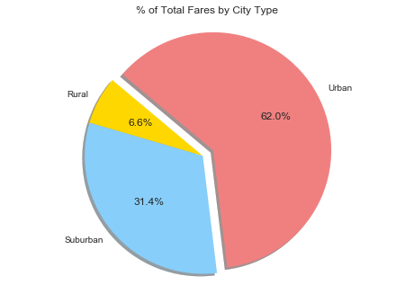
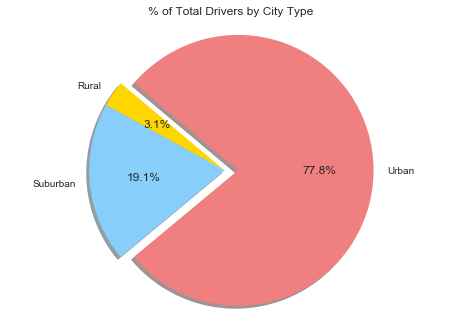
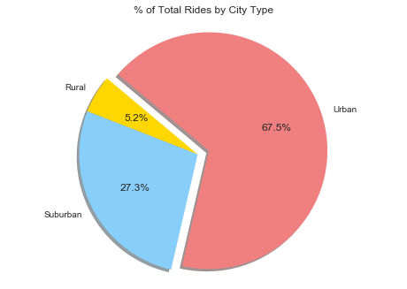
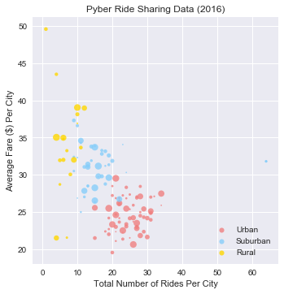

```python
import csv
import matplotlib.pyplot as plt
import numpy as np
import pandas as pd
import seaborn as sns
sns.set()

 
ride = pd.read_csv('ride_data.csv', sep=',')
 
city = pd.read_csv('city_data.csv', sep=',')
```


```python
ride
```


<div>
<table border="1" class="dataframe">
  <thead>
    <tr style="text-align: right;">
      <th></th>
      <th>city</th>
      <th>date</th>
      <th>fare</th>
      <th>ride_id</th>
    </tr>
  </thead>
  <tbody>
    <tr>
      <th>0</th>
      <td>Sarabury</td>
      <td>2016-01-16 13:49:27</td>
      <td>38.35</td>
      <td>5403689035038</td>
    </tr>
    <tr>
      <th>1</th>
      <td>South Roy</td>
      <td>2016-01-02 18:42:34</td>
      <td>17.49</td>
      <td>4036272335942</td>
    </tr>
    <tr>
      <th>2</th>
      <td>Wiseborough</td>
      <td>2016-01-21 17:35:29</td>
      <td>44.18</td>
      <td>3645042422587</td>
    </tr>
    <tr>
      <th>3</th>
      <td>Spencertown</td>
      <td>2016-07-31 14:53:22</td>
      <td>6.87</td>
      <td>2242596575892</td>
    </tr>
    <tr>
      <th>4</th>
      <td>Nguyenbury</td>
      <td>2016-07-09 04:42:44</td>
      <td>6.28</td>
      <td>1543057793673</td>
    </tr>
    <tr>
      <th>5</th>
      <td>New Jeffrey</td>
      <td>2016-02-22 18:36:25</td>
      <td>36.01</td>
      <td>9757888452346</td>
    </tr>
    <tr>
      <th>6</th>
      <td>Port Johnstad</td>
      <td>2016-06-07 02:39:58</td>
      <td>17.15</td>
      <td>4352278259335</td>
    </tr>
    <tr>
      <th>7</th>
      <td>Jacobfort</td>
      <td>2016-09-20 20:58:37</td>
      <td>22.98</td>
      <td>1500221409082</td>
    </tr>
    <tr>
      <th>8</th>
      <td>Travisville</td>
      <td>2016-01-15 17:32:02</td>
      <td>27.39</td>
      <td>850152768361</td>
    </tr>
    <tr>
      <th>9</th>
      <td>Sandymouth</td>
      <td>2016-11-16 07:27:00</td>
      <td>21.61</td>
      <td>2389035050524</td>
    </tr>
    <tr>
      <th>10</th>
      <td>New Andreamouth</td>
      <td>2016-04-11 07:20:48</td>
      <td>7.72</td>
      <td>9992929847990</td>
    </tr>
    <tr>
      <th>11</th>
      <td>New Christine</td>
      <td>2016-09-13 15:06:42</td>
      <td>24.89</td>
      <td>7918411468537</td>
    </tr>
    <tr>
      <th>12</th>
      <td>Stewartview</td>
      <td>2016-03-29 05:15:56</td>
      <td>23.88</td>
      <td>6778235889588</td>
    </tr>
    <tr>
      <th>13</th>
      <td>Rodriguezburgh</td>
      <td>2016-09-05 05:20:39</td>
      <td>4.54</td>
      <td>9650770953139</td>
    </tr>
    <tr>
      <th>14</th>
      <td>West Sydneyhaven</td>
      <td>2016-08-02 21:18:44</td>
      <td>12.87</td>
      <td>7994760397230</td>
    </tr>
    <tr>
      <th>15</th>
      <td>Swansonbury</td>
      <td>2016-07-11 18:42:11</td>
      <td>39.30</td>
      <td>744481862626</td>
    </tr>
    <tr>
      <th>16</th>
      <td>Lisatown</td>
      <td>2016-07-05 18:09:14</td>
      <td>5.82</td>
      <td>6370359473201</td>
    </tr>
    <tr>
      <th>17</th>
      <td>East Erin</td>
      <td>2016-11-03 01:03:05</td>
      <td>7.51</td>
      <td>4744239092530</td>
    </tr>
    <tr>
      <th>18</th>
      <td>Port Martinberg</td>
      <td>2016-01-06 17:11:30</td>
      <td>8.66</td>
      <td>7298562820881</td>
    </tr>
    <tr>
      <th>19</th>
      <td>Wiseborough</td>
      <td>2016-09-12 18:43:41</td>
      <td>26.83</td>
      <td>9304728540000</td>
    </tr>
    <tr>
      <th>20</th>
      <td>Edwardsbury</td>
      <td>2016-02-27 03:55:54</td>
      <td>20.17</td>
      <td>8514523868075</td>
    </tr>
    <tr>
      <th>21</th>
      <td>Jacobfort</td>
      <td>2016-06-12 17:01:29</td>
      <td>34.47</td>
      <td>4135673527977</td>
    </tr>
    <tr>
      <th>22</th>
      <td>Pamelahaven</td>
      <td>2016-03-26 12:56:57</td>
      <td>36.43</td>
      <td>3015329826849</td>
    </tr>
    <tr>
      <th>23</th>
      <td>Fosterside</td>
      <td>2016-08-12 11:52:41</td>
      <td>28.08</td>
      <td>133077693483</td>
    </tr>
    <tr>
      <th>24</th>
      <td>Jacobfort</td>
      <td>2016-09-17 12:38:58</td>
      <td>38.25</td>
      <td>2182376146051</td>
    </tr>
    <tr>
      <th>25</th>
      <td>West Sydneyhaven</td>
      <td>2016-08-23 14:49:59</td>
      <td>36.12</td>
      <td>5885997568611</td>
    </tr>
    <tr>
      <th>26</th>
      <td>West Alexis</td>
      <td>2016-01-16 00:33:02</td>
      <td>26.62</td>
      <td>1574788996743</td>
    </tr>
    <tr>
      <th>27</th>
      <td>Carrollfort</td>
      <td>2016-06-24 20:11:11</td>
      <td>6.45</td>
      <td>1092683495142</td>
    </tr>
    <tr>
      <th>28</th>
      <td>New David</td>
      <td>2016-01-12 20:48:43</td>
      <td>38.68</td>
      <td>5229089333754</td>
    </tr>
    <tr>
      <th>29</th>
      <td>Stewartview</td>
      <td>2016-10-15 05:26:40</td>
      <td>11.74</td>
      <td>8402784599831</td>
    </tr>
    <tr>
      <th>...</th>
      <td>...</td>
      <td>...</td>
      <td>...</td>
      <td>...</td>
    </tr>
    <tr>
      <th>2345</th>
      <td>West Kevintown</td>
      <td>2016-06-15 19:53:16</td>
      <td>13.50</td>
      <td>9577921579881</td>
    </tr>
    <tr>
      <th>2346</th>
      <td>Matthewside</td>
      <td>2016-02-23 00:43:51</td>
      <td>40.84</td>
      <td>8665248512368</td>
    </tr>
    <tr>
      <th>2347</th>
      <td>Erikport</td>
      <td>2016-11-26 04:39:52</td>
      <td>44.21</td>
      <td>9598643212986</td>
    </tr>
    <tr>
      <th>2348</th>
      <td>Kinghaven</td>
      <td>2016-07-23 08:23:50</td>
      <td>46.08</td>
      <td>8440329717166</td>
    </tr>
    <tr>
      <th>2349</th>
      <td>Hernandezshire</td>
      <td>2016-02-24 17:30:44</td>
      <td>44.68</td>
      <td>6389115653382</td>
    </tr>
    <tr>
      <th>2350</th>
      <td>Kennethburgh</td>
      <td>2016-01-01 04:31:43</td>
      <td>33.53</td>
      <td>5149088250183</td>
    </tr>
    <tr>
      <th>2351</th>
      <td>Stevensport</td>
      <td>2016-02-22 02:45:07</td>
      <td>19.91</td>
      <td>808097865942</td>
    </tr>
    <tr>
      <th>2352</th>
      <td>South Elizabethmouth</td>
      <td>2016-11-23 07:47:18</td>
      <td>46.39</td>
      <td>1939838068038</td>
    </tr>
    <tr>
      <th>2353</th>
      <td>East Stephen</td>
      <td>2016-07-30 21:25:01</td>
      <td>35.39</td>
      <td>1107870956099</td>
    </tr>
    <tr>
      <th>2354</th>
      <td>Jacksonfort</td>
      <td>2016-10-01 13:41:00</td>
      <td>34.17</td>
      <td>7750597960630</td>
    </tr>
    <tr>
      <th>2355</th>
      <td>Kennethburgh</td>
      <td>2016-04-30 20:44:27</td>
      <td>23.58</td>
      <td>4524301143267</td>
    </tr>
    <tr>
      <th>2356</th>
      <td>Horneland</td>
      <td>2016-03-25 02:05:42</td>
      <td>20.04</td>
      <td>5729327140644</td>
    </tr>
    <tr>
      <th>2357</th>
      <td>Shelbyhaven</td>
      <td>2016-01-25 01:39:16</td>
      <td>59.43</td>
      <td>8088329954312</td>
    </tr>
    <tr>
      <th>2358</th>
      <td>Erikport</td>
      <td>2016-08-03 21:19:11</td>
      <td>47.67</td>
      <td>9201708664049</td>
    </tr>
    <tr>
      <th>2359</th>
      <td>Kennethburgh</td>
      <td>2016-11-19 06:59:31</td>
      <td>18.37</td>
      <td>5897895798960</td>
    </tr>
    <tr>
      <th>2360</th>
      <td>Jacksonfort</td>
      <td>2016-10-20 16:42:54</td>
      <td>37.75</td>
      <td>4356781814784</td>
    </tr>
    <tr>
      <th>2361</th>
      <td>South Joseph</td>
      <td>2016-10-15 03:53:06</td>
      <td>32.50</td>
      <td>2758038144583</td>
    </tr>
    <tr>
      <th>2362</th>
      <td>Matthewside</td>
      <td>2016-05-18 02:00:30</td>
      <td>48.67</td>
      <td>2049161404256</td>
    </tr>
    <tr>
      <th>2363</th>
      <td>Matthewside</td>
      <td>2016-08-08 14:02:35</td>
      <td>24.97</td>
      <td>2872494724827</td>
    </tr>
    <tr>
      <th>2364</th>
      <td>South Joseph</td>
      <td>2016-10-28 09:52:15</td>
      <td>25.34</td>
      <td>6706101910500</td>
    </tr>
    <tr>
      <th>2365</th>
      <td>South Elizabethmouth</td>
      <td>2016-07-19 09:35:59</td>
      <td>31.09</td>
      <td>2959749591417</td>
    </tr>
    <tr>
      <th>2366</th>
      <td>North Whitney</td>
      <td>2016-11-11 16:24:16</td>
      <td>22.99</td>
      <td>3454326063039</td>
    </tr>
    <tr>
      <th>2367</th>
      <td>New Johnbury</td>
      <td>2016-08-29 02:36:06</td>
      <td>18.83</td>
      <td>7368222134792</td>
    </tr>
    <tr>
      <th>2368</th>
      <td>East Leslie</td>
      <td>2016-06-22 07:45:30</td>
      <td>34.54</td>
      <td>684950063164</td>
    </tr>
    <tr>
      <th>2369</th>
      <td>Kennethburgh</td>
      <td>2016-06-07 11:43:43</td>
      <td>56.02</td>
      <td>311733202150</td>
    </tr>
    <tr>
      <th>2370</th>
      <td>West Kevintown</td>
      <td>2016-02-10 00:50:04</td>
      <td>34.69</td>
      <td>9595491362610</td>
    </tr>
    <tr>
      <th>2371</th>
      <td>East Troybury</td>
      <td>2016-03-14 01:55:32</td>
      <td>38.80</td>
      <td>9205811495606</td>
    </tr>
    <tr>
      <th>2372</th>
      <td>North Whitney</td>
      <td>2016-01-26 01:06:41</td>
      <td>34.92</td>
      <td>4165974278063</td>
    </tr>
    <tr>
      <th>2373</th>
      <td>South Joseph</td>
      <td>2016-09-28 07:30:55</td>
      <td>12.55</td>
      <td>4336212615821</td>
    </tr>
    <tr>
      <th>2374</th>
      <td>South Elizabethmouth</td>
      <td>2016-04-21 10:20:09</td>
      <td>16.50</td>
      <td>5702608059064</td>
    </tr>
  </tbody>
</table>
<p>2375 rows × 4 columns</p>
</div>


```python
city.head()
```


<div>
<table border="1" class="dataframe">
  <thead>
    <tr style="text-align: right;">
      <th></th>
      <th>city</th>
      <th>driver_count</th>
      <th>type</th>
    </tr>
  </thead>
  <tbody>
    <tr>
      <th>0</th>
      <td>Kelseyland</td>
      <td>63</td>
      <td>Urban</td>
    </tr>
    <tr>
      <th>1</th>
      <td>Nguyenbury</td>
      <td>8</td>
      <td>Urban</td>
    </tr>
    <tr>
      <th>2</th>
      <td>East Douglas</td>
      <td>12</td>
      <td>Urban</td>
    </tr>
    <tr>
      <th>3</th>
      <td>West Dawnfurt</td>
      <td>34</td>
      <td>Urban</td>
    </tr>
    <tr>
      <th>4</th>
      <td>Rodriguezburgh</td>
      <td>52</td>
      <td>Urban</td>
    </tr>
  </tbody>
</table>
</div>


```python
ride_grp = ride.groupby(['city']).sum().reset_index()

ride_grp

```


<div>
<table border="1" class="dataframe">
  <thead>
    <tr style="text-align: right;">
      <th></th>
      <th>city</th>
      <th>fare</th>
      <th>ride_id</th>
    </tr>
  </thead>
  <tbody>
    <tr>
      <th>0</th>
      <td>Alvarezhaven</td>
      <td>741.79</td>
      <td>165899161874789</td>
    </tr>
    <tr>
      <th>1</th>
      <td>Alyssaberg</td>
      <td>535.85</td>
      <td>91953627077845</td>
    </tr>
    <tr>
      <th>2</th>
      <td>Anitamouth</td>
      <td>335.84</td>
      <td>37762826439863</td>
    </tr>
    <tr>
      <th>3</th>
      <td>Antoniomouth</td>
      <td>519.75</td>
      <td>111909606921566</td>
    </tr>
    <tr>
      <th>4</th>
      <td>Aprilchester</td>
      <td>417.65</td>
      <td>86920968698689</td>
    </tr>
    <tr>
      <th>5</th>
      <td>Arnoldview</td>
      <td>778.30</td>
      <td>155680516453154</td>
    </tr>
    <tr>
      <th>6</th>
      <td>Campbellport</td>
      <td>505.67</td>
      <td>87081359966001</td>
    </tr>
    <tr>
      <th>7</th>
      <td>Carrollbury</td>
      <td>366.06</td>
      <td>42746154832213</td>
    </tr>
    <tr>
      <th>8</th>
      <td>Carrollfort</td>
      <td>736.47</td>
      <td>138011218621745</td>
    </tr>
    <tr>
      <th>9</th>
      <td>Clarkstad</td>
      <td>372.62</td>
      <td>80192945283941</td>
    </tr>
    <tr>
      <th>10</th>
      <td>Conwaymouth</td>
      <td>380.51</td>
      <td>48308135196746</td>
    </tr>
    <tr>
      <th>11</th>
      <td>Davidtown</td>
      <td>482.54</td>
      <td>122850096918371</td>
    </tr>
    <tr>
      <th>12</th>
      <td>Davistown</td>
      <td>537.43</td>
      <td>109049430394422</td>
    </tr>
    <tr>
      <th>13</th>
      <td>East Cherylfurt</td>
      <td>408.41</td>
      <td>51755429107151</td>
    </tr>
    <tr>
      <th>14</th>
      <td>East Douglas</td>
      <td>575.72</td>
      <td>104110928441114</td>
    </tr>
    <tr>
      <th>15</th>
      <td>East Erin</td>
      <td>685.39</td>
      <td>146335263646091</td>
    </tr>
    <tr>
      <th>16</th>
      <td>East Jenniferchester</td>
      <td>619.39</td>
      <td>112729038851138</td>
    </tr>
    <tr>
      <th>17</th>
      <td>East Leslie</td>
      <td>370.27</td>
      <td>66561575296093</td>
    </tr>
    <tr>
      <th>18</th>
      <td>East Stephen</td>
      <td>390.53</td>
      <td>53063273613807</td>
    </tr>
    <tr>
      <th>19</th>
      <td>East Troybury</td>
      <td>232.71</td>
      <td>41637638844907</td>
    </tr>
    <tr>
      <th>20</th>
      <td>Edwardsbury</td>
      <td>725.67</td>
      <td>142995149955093</td>
    </tr>
    <tr>
      <th>21</th>
      <td>Erikport</td>
      <td>240.35</td>
      <td>55064119128623</td>
    </tr>
    <tr>
      <th>22</th>
      <td>Eriktown</td>
      <td>484.10</td>
      <td>78150241601348</td>
    </tr>
    <tr>
      <th>23</th>
      <td>Floresberg</td>
      <td>323.10</td>
      <td>26303190411293</td>
    </tr>
    <tr>
      <th>24</th>
      <td>Fosterside</td>
      <td>552.83</td>
      <td>122427139452426</td>
    </tr>
    <tr>
      <th>25</th>
      <td>Hernandezshire</td>
      <td>288.02</td>
      <td>46855891812045</td>
    </tr>
    <tr>
      <th>26</th>
      <td>Horneland</td>
      <td>85.93</td>
      <td>21407156167741</td>
    </tr>
    <tr>
      <th>27</th>
      <td>Jacksonfort</td>
      <td>192.04</td>
      <td>27665127138520</td>
    </tr>
    <tr>
      <th>28</th>
      <td>Jacobfort</td>
      <td>768.16</td>
      <td>127071827580827</td>
    </tr>
    <tr>
      <th>29</th>
      <td>Jasonfort</td>
      <td>333.98</td>
      <td>77270188680128</td>
    </tr>
    <tr>
      <th>...</th>
      <td>...</td>
      <td>...</td>
      <td>...</td>
    </tr>
    <tr>
      <th>95</th>
      <td>South Roy</td>
      <td>572.69</td>
      <td>106969479769264</td>
    </tr>
    <tr>
      <th>96</th>
      <td>South Shannonborough</td>
      <td>397.75</td>
      <td>72373118861919</td>
    </tr>
    <tr>
      <th>97</th>
      <td>Spencertown</td>
      <td>615.71</td>
      <td>126114546126788</td>
    </tr>
    <tr>
      <th>98</th>
      <td>Stevensport</td>
      <td>159.74</td>
      <td>15628602628342</td>
    </tr>
    <tr>
      <th>99</th>
      <td>Stewartview</td>
      <td>648.42</td>
      <td>148100838345590</td>
    </tr>
    <tr>
      <th>100</th>
      <td>Swansonbury</td>
      <td>933.80</td>
      <td>151062943394537</td>
    </tr>
    <tr>
      <th>101</th>
      <td>Thomastown</td>
      <td>727.40</td>
      <td>108615188357498</td>
    </tr>
    <tr>
      <th>102</th>
      <td>Tiffanyton</td>
      <td>370.63</td>
      <td>64589955138430</td>
    </tr>
    <tr>
      <th>103</th>
      <td>Torresshire</td>
      <td>629.39</td>
      <td>133065581883609</td>
    </tr>
    <tr>
      <th>104</th>
      <td>Travisville</td>
      <td>626.08</td>
      <td>76302658107954</td>
    </tr>
    <tr>
      <th>105</th>
      <td>Vickimouth</td>
      <td>322.12</td>
      <td>63641072786753</td>
    </tr>
    <tr>
      <th>106</th>
      <td>Webstertown</td>
      <td>475.54</td>
      <td>70423434921161</td>
    </tr>
    <tr>
      <th>107</th>
      <td>West Alexis</td>
      <td>390.46</td>
      <td>102675318141168</td>
    </tr>
    <tr>
      <th>108</th>
      <td>West Brandy</td>
      <td>724.73</td>
      <td>140203050563386</td>
    </tr>
    <tr>
      <th>109</th>
      <td>West Brittanyton</td>
      <td>610.47</td>
      <td>139127420368493</td>
    </tr>
    <tr>
      <th>110</th>
      <td>West Dawnfurt</td>
      <td>647.58</td>
      <td>148466691609824</td>
    </tr>
    <tr>
      <th>111</th>
      <td>West Evan</td>
      <td>324.16</td>
      <td>65347392852623</td>
    </tr>
    <tr>
      <th>112</th>
      <td>West Jefferyfurt</td>
      <td>442.53</td>
      <td>75903180763582</td>
    </tr>
    <tr>
      <th>113</th>
      <td>West Kevintown</td>
      <td>150.70</td>
      <td>49015198763480</td>
    </tr>
    <tr>
      <th>114</th>
      <td>West Oscar</td>
      <td>704.12</td>
      <td>131246533819841</td>
    </tr>
    <tr>
      <th>115</th>
      <td>West Pamelaborough</td>
      <td>473.19</td>
      <td>57141292201330</td>
    </tr>
    <tr>
      <th>116</th>
      <td>West Paulport</td>
      <td>565.73</td>
      <td>83223831868102</td>
    </tr>
    <tr>
      <th>117</th>
      <td>West Peter</td>
      <td>771.14</td>
      <td>143553740646342</td>
    </tr>
    <tr>
      <th>118</th>
      <td>West Sydneyhaven</td>
      <td>402.63</td>
      <td>79780212583099</td>
    </tr>
    <tr>
      <th>119</th>
      <td>West Tony</td>
      <td>562.58</td>
      <td>96522785457789</td>
    </tr>
    <tr>
      <th>120</th>
      <td>Williamchester</td>
      <td>377.06</td>
      <td>62472245620363</td>
    </tr>
    <tr>
      <th>121</th>
      <td>Williamshire</td>
      <td>836.70</td>
      <td>153068829069985</td>
    </tr>
    <tr>
      <th>122</th>
      <td>Wiseborough</td>
      <td>430.86</td>
      <td>114884919652866</td>
    </tr>
    <tr>
      <th>123</th>
      <td>Yolandafurt</td>
      <td>544.11</td>
      <td>97417338184348</td>
    </tr>
    <tr>
      <th>124</th>
      <td>Zimmermanmouth</td>
      <td>679.24</td>
      <td>110849624954937</td>
    </tr>
  </tbody>
</table>
<p>125 rows × 3 columns</p>
</div>


```python
merged_table = ride_grp.merge(city, on='city', how="outer")
merged_table
```


<div>
<table border="1" class="dataframe">
  <thead>
    <tr style="text-align: right;">
      <th></th>
      <th>city</th>
      <th>fare</th>
      <th>ride_id</th>
      <th>driver_count</th>
      <th>type</th>
    </tr>
  </thead>
  <tbody>
    <tr>
      <th>0</th>
      <td>Alvarezhaven</td>
      <td>741.79</td>
      <td>165899161874789</td>
      <td>21</td>
      <td>Urban</td>
    </tr>
    <tr>
      <th>1</th>
      <td>Alyssaberg</td>
      <td>535.85</td>
      <td>91953627077845</td>
      <td>67</td>
      <td>Urban</td>
    </tr>
    <tr>
      <th>2</th>
      <td>Anitamouth</td>
      <td>335.84</td>
      <td>37762826439863</td>
      <td>16</td>
      <td>Suburban</td>
    </tr>
    <tr>
      <th>3</th>
      <td>Antoniomouth</td>
      <td>519.75</td>
      <td>111909606921566</td>
      <td>21</td>
      <td>Urban</td>
    </tr>
    <tr>
      <th>4</th>
      <td>Aprilchester</td>
      <td>417.65</td>
      <td>86920968698689</td>
      <td>49</td>
      <td>Urban</td>
    </tr>
    <tr>
      <th>5</th>
      <td>Arnoldview</td>
      <td>778.30</td>
      <td>155680516453154</td>
      <td>41</td>
      <td>Urban</td>
    </tr>
    <tr>
      <th>6</th>
      <td>Campbellport</td>
      <td>505.67</td>
      <td>87081359966001</td>
      <td>26</td>
      <td>Suburban</td>
    </tr>
    <tr>
      <th>7</th>
      <td>Carrollbury</td>
      <td>366.06</td>
      <td>42746154832213</td>
      <td>4</td>
      <td>Suburban</td>
    </tr>
    <tr>
      <th>8</th>
      <td>Carrollfort</td>
      <td>736.47</td>
      <td>138011218621745</td>
      <td>55</td>
      <td>Urban</td>
    </tr>
    <tr>
      <th>9</th>
      <td>Clarkstad</td>
      <td>372.62</td>
      <td>80192945283941</td>
      <td>21</td>
      <td>Suburban</td>
    </tr>
    <tr>
      <th>10</th>
      <td>Conwaymouth</td>
      <td>380.51</td>
      <td>48308135196746</td>
      <td>18</td>
      <td>Suburban</td>
    </tr>
    <tr>
      <th>11</th>
      <td>Davidtown</td>
      <td>482.54</td>
      <td>122850096918371</td>
      <td>73</td>
      <td>Urban</td>
    </tr>
    <tr>
      <th>12</th>
      <td>Davistown</td>
      <td>537.43</td>
      <td>109049430394422</td>
      <td>25</td>
      <td>Urban</td>
    </tr>
    <tr>
      <th>13</th>
      <td>East Cherylfurt</td>
      <td>408.41</td>
      <td>51755429107151</td>
      <td>9</td>
      <td>Suburban</td>
    </tr>
    <tr>
      <th>14</th>
      <td>East Douglas</td>
      <td>575.72</td>
      <td>104110928441114</td>
      <td>12</td>
      <td>Urban</td>
    </tr>
    <tr>
      <th>15</th>
      <td>East Erin</td>
      <td>685.39</td>
      <td>146335263646091</td>
      <td>43</td>
      <td>Urban</td>
    </tr>
    <tr>
      <th>16</th>
      <td>East Jenniferchester</td>
      <td>619.39</td>
      <td>112729038851138</td>
      <td>22</td>
      <td>Suburban</td>
    </tr>
    <tr>
      <th>17</th>
      <td>East Leslie</td>
      <td>370.27</td>
      <td>66561575296093</td>
      <td>9</td>
      <td>Rural</td>
    </tr>
    <tr>
      <th>18</th>
      <td>East Stephen</td>
      <td>390.53</td>
      <td>53063273613807</td>
      <td>6</td>
      <td>Rural</td>
    </tr>
    <tr>
      <th>19</th>
      <td>East Troybury</td>
      <td>232.71</td>
      <td>41637638844907</td>
      <td>3</td>
      <td>Rural</td>
    </tr>
    <tr>
      <th>20</th>
      <td>Edwardsbury</td>
      <td>725.67</td>
      <td>142995149955093</td>
      <td>11</td>
      <td>Urban</td>
    </tr>
    <tr>
      <th>21</th>
      <td>Erikport</td>
      <td>240.35</td>
      <td>55064119128623</td>
      <td>3</td>
      <td>Rural</td>
    </tr>
    <tr>
      <th>22</th>
      <td>Eriktown</td>
      <td>484.10</td>
      <td>78150241601348</td>
      <td>15</td>
      <td>Urban</td>
    </tr>
    <tr>
      <th>23</th>
      <td>Floresberg</td>
      <td>323.10</td>
      <td>26303190411293</td>
      <td>7</td>
      <td>Suburban</td>
    </tr>
    <tr>
      <th>24</th>
      <td>Fosterside</td>
      <td>552.83</td>
      <td>122427139452426</td>
      <td>69</td>
      <td>Urban</td>
    </tr>
    <tr>
      <th>25</th>
      <td>Hernandezshire</td>
      <td>288.02</td>
      <td>46855891812045</td>
      <td>10</td>
      <td>Rural</td>
    </tr>
    <tr>
      <th>26</th>
      <td>Horneland</td>
      <td>85.93</td>
      <td>21407156167741</td>
      <td>8</td>
      <td>Rural</td>
    </tr>
    <tr>
      <th>27</th>
      <td>Jacksonfort</td>
      <td>192.04</td>
      <td>27665127138520</td>
      <td>6</td>
      <td>Rural</td>
    </tr>
    <tr>
      <th>28</th>
      <td>Jacobfort</td>
      <td>768.16</td>
      <td>127071827580827</td>
      <td>52</td>
      <td>Urban</td>
    </tr>
    <tr>
      <th>29</th>
      <td>Jasonfort</td>
      <td>333.98</td>
      <td>77270188680128</td>
      <td>25</td>
      <td>Suburban</td>
    </tr>
    <tr>
      <th>...</th>
      <td>...</td>
      <td>...</td>
      <td>...</td>
      <td>...</td>
      <td>...</td>
    </tr>
    <tr>
      <th>96</th>
      <td>South Roy</td>
      <td>572.69</td>
      <td>106969479769264</td>
      <td>35</td>
      <td>Urban</td>
    </tr>
    <tr>
      <th>97</th>
      <td>South Shannonborough</td>
      <td>397.75</td>
      <td>72373118861919</td>
      <td>9</td>
      <td>Suburban</td>
    </tr>
    <tr>
      <th>98</th>
      <td>Spencertown</td>
      <td>615.71</td>
      <td>126114546126788</td>
      <td>68</td>
      <td>Urban</td>
    </tr>
    <tr>
      <th>99</th>
      <td>Stevensport</td>
      <td>159.74</td>
      <td>15628602628342</td>
      <td>6</td>
      <td>Rural</td>
    </tr>
    <tr>
      <th>100</th>
      <td>Stewartview</td>
      <td>648.42</td>
      <td>148100838345590</td>
      <td>49</td>
      <td>Urban</td>
    </tr>
    <tr>
      <th>101</th>
      <td>Swansonbury</td>
      <td>933.80</td>
      <td>151062943394537</td>
      <td>64</td>
      <td>Urban</td>
    </tr>
    <tr>
      <th>102</th>
      <td>Thomastown</td>
      <td>727.40</td>
      <td>108615188357498</td>
      <td>1</td>
      <td>Suburban</td>
    </tr>
    <tr>
      <th>103</th>
      <td>Tiffanyton</td>
      <td>370.63</td>
      <td>64589955138430</td>
      <td>21</td>
      <td>Suburban</td>
    </tr>
    <tr>
      <th>104</th>
      <td>Torresshire</td>
      <td>629.39</td>
      <td>133065581883609</td>
      <td>70</td>
      <td>Urban</td>
    </tr>
    <tr>
      <th>105</th>
      <td>Travisville</td>
      <td>626.08</td>
      <td>76302658107954</td>
      <td>37</td>
      <td>Urban</td>
    </tr>
    <tr>
      <th>106</th>
      <td>Vickimouth</td>
      <td>322.12</td>
      <td>63641072786753</td>
      <td>13</td>
      <td>Urban</td>
    </tr>
    <tr>
      <th>107</th>
      <td>Webstertown</td>
      <td>475.54</td>
      <td>70423434921161</td>
      <td>26</td>
      <td>Suburban</td>
    </tr>
    <tr>
      <th>108</th>
      <td>West Alexis</td>
      <td>390.46</td>
      <td>102675318141168</td>
      <td>47</td>
      <td>Urban</td>
    </tr>
    <tr>
      <th>109</th>
      <td>West Brandy</td>
      <td>724.73</td>
      <td>140203050563386</td>
      <td>12</td>
      <td>Urban</td>
    </tr>
    <tr>
      <th>110</th>
      <td>West Brittanyton</td>
      <td>610.47</td>
      <td>139127420368493</td>
      <td>9</td>
      <td>Urban</td>
    </tr>
    <tr>
      <th>111</th>
      <td>West Dawnfurt</td>
      <td>647.58</td>
      <td>148466691609824</td>
      <td>34</td>
      <td>Urban</td>
    </tr>
    <tr>
      <th>112</th>
      <td>West Evan</td>
      <td>324.16</td>
      <td>65347392852623</td>
      <td>4</td>
      <td>Suburban</td>
    </tr>
    <tr>
      <th>113</th>
      <td>West Jefferyfurt</td>
      <td>442.53</td>
      <td>75903180763582</td>
      <td>65</td>
      <td>Urban</td>
    </tr>
    <tr>
      <th>114</th>
      <td>West Kevintown</td>
      <td>150.70</td>
      <td>49015198763480</td>
      <td>5</td>
      <td>Rural</td>
    </tr>
    <tr>
      <th>115</th>
      <td>West Oscar</td>
      <td>704.12</td>
      <td>131246533819841</td>
      <td>11</td>
      <td>Urban</td>
    </tr>
    <tr>
      <th>116</th>
      <td>West Pamelaborough</td>
      <td>473.19</td>
      <td>57141292201330</td>
      <td>27</td>
      <td>Suburban</td>
    </tr>
    <tr>
      <th>117</th>
      <td>West Paulport</td>
      <td>565.73</td>
      <td>83223831868102</td>
      <td>5</td>
      <td>Suburban</td>
    </tr>
    <tr>
      <th>118</th>
      <td>West Peter</td>
      <td>771.14</td>
      <td>143553740646342</td>
      <td>61</td>
      <td>Urban</td>
    </tr>
    <tr>
      <th>119</th>
      <td>West Sydneyhaven</td>
      <td>402.63</td>
      <td>79780212583099</td>
      <td>70</td>
      <td>Urban</td>
    </tr>
    <tr>
      <th>120</th>
      <td>West Tony</td>
      <td>562.58</td>
      <td>96522785457789</td>
      <td>17</td>
      <td>Suburban</td>
    </tr>
    <tr>
      <th>121</th>
      <td>Williamchester</td>
      <td>377.06</td>
      <td>62472245620363</td>
      <td>26</td>
      <td>Suburban</td>
    </tr>
    <tr>
      <th>122</th>
      <td>Williamshire</td>
      <td>836.70</td>
      <td>153068829069985</td>
      <td>70</td>
      <td>Urban</td>
    </tr>
    <tr>
      <th>123</th>
      <td>Wiseborough</td>
      <td>430.86</td>
      <td>114884919652866</td>
      <td>55</td>
      <td>Urban</td>
    </tr>
    <tr>
      <th>124</th>
      <td>Yolandafurt</td>
      <td>544.11</td>
      <td>97417338184348</td>
      <td>7</td>
      <td>Urban</td>
    </tr>
    <tr>
      <th>125</th>
      <td>Zimmermanmouth</td>
      <td>679.24</td>
      <td>110849624954937</td>
      <td>45</td>
      <td>Urban</td>
    </tr>
  </tbody>
</table>
<p>126 rows × 5 columns</p>
</div>


```python
#It might be best to group these by the type since we are looking at fares & driver counts
grp = merged_table.groupby(['type']).sum().reset_index()
grp
```


<div>
<table border="1" class="dataframe">
  <thead>
    <tr style="text-align: right;">
      <th></th>
      <th>type</th>
      <th>fare</th>
      <th>ride_id</th>
      <th>driver_count</th>
    </tr>
  </thead>
  <tbody>
    <tr>
      <th>0</th>
      <td>Rural</td>
      <td>4255.09</td>
      <td>658729360193746</td>
      <td>104</td>
    </tr>
    <tr>
      <th>1</th>
      <td>Suburban</td>
      <td>20335.69</td>
      <td>3139583688401015</td>
      <td>638</td>
    </tr>
    <tr>
      <th>2</th>
      <td>Urban</td>
      <td>40078.34</td>
      <td>7890194186030600</td>
      <td>2607</td>
    </tr>
  </tbody>
</table>
</div>


```python
# % of Fares by City Type

city_type = grp['type']
total_fare = grp['fare']
colors = ["Gold","#87cefa","#f08080"]
explode = (0,0,0.1)
```


```python
plt.pie(total_fare, explode=explode, labels=city_type, colors=colors,
        autopct="%1.1f%%", shadow=True, startangle=140)

```


    ([<matplotlib.patches.Wedge at 0x1d8c0953080>,
      <matplotlib.patches.Wedge at 0x1d8c095b908>,
      <matplotlib.patches.Wedge at 0x1d8c096a208>],
     [<matplotlib.text.Text at 0x1d8c0953e10>,
      <matplotlib.text.Text at 0x1d8c0962710>,
      <matplotlib.text.Text at 0x1d8c096afd0>],
     [<matplotlib.text.Text at 0x1d8c095b3c8>,
      <matplotlib.text.Text at 0x1d8c0962c88>,
      <matplotlib.text.Text at 0x1d8c0973588>])


```python
# Create axes which are equal so we have a perfect circle
plt.axis("equal")
```


    (-1.1176639226730507,
     1.194567077744406,
     -1.1162114572424728,
     1.1625457019480223)


```python
plt.title('% of Total Fares by City Type')
```


    <matplotlib.text.Text at 0x1d8c0af3be0>


```python
plt.show()
```





```python
# % of Total Drivers by City Type
city_type = grp['type']
total_drivers = grp['driver_count']
colors = ["Gold","#87cefa","#f08080"]
explode = (0,0,0.1)
```


```python
plt.pie(total_drivers, explode=explode, labels=city_type, colors=colors,
        autopct="%1.1f%%", shadow=True, startangle=140)
```


    ([<matplotlib.patches.Wedge at 0x1d8c09e4898>,
      <matplotlib.patches.Wedge at 0x1d8c09f3160>,
      <matplotlib.patches.Wedge at 0x1d8c09fca20>],
     [<matplotlib.text.Text at 0x1d8c09ee668>,
      <matplotlib.text.Text at 0x1d8c09f3f28>,
      <matplotlib.text.Text at 0x1d8c0a04828>],
     [<matplotlib.text.Text at 0x1d8c09eebe0>,
      <matplotlib.text.Text at 0x1d8c09fc4e0>,
      <matplotlib.text.Text at 0x1d8c0a04da0>])


```python
# Create axes which are equal so we have a perfect circle
plt.axis("equal")
```


    (-1.120345126658332,
     1.205951186449713,
     -1.1038487708834486,
     1.1036806907057752)


```python
plt.title('% of Total Drivers by City Type')
```


    <matplotlib.text.Text at 0x1d8c09bb9b0>


```python
# Show
plt.show()
```





```python
merged_table2 = ride.merge(city, on='city', how="outer")
merged_table2

```


<div>
<table border="1" class="dataframe">
  <thead>
    <tr style="text-align: right;">
      <th></th>
      <th>city</th>
      <th>date</th>
      <th>fare</th>
      <th>ride_id</th>
      <th>driver_count</th>
      <th>type</th>
    </tr>
  </thead>
  <tbody>
    <tr>
      <th>0</th>
      <td>Sarabury</td>
      <td>2016-01-16 13:49:27</td>
      <td>38.35</td>
      <td>5403689035038</td>
      <td>46</td>
      <td>Urban</td>
    </tr>
    <tr>
      <th>1</th>
      <td>Sarabury</td>
      <td>2016-07-23 07:42:44</td>
      <td>21.76</td>
      <td>7546681945283</td>
      <td>46</td>
      <td>Urban</td>
    </tr>
    <tr>
      <th>2</th>
      <td>Sarabury</td>
      <td>2016-04-02 04:32:25</td>
      <td>38.03</td>
      <td>4932495851866</td>
      <td>46</td>
      <td>Urban</td>
    </tr>
    <tr>
      <th>3</th>
      <td>Sarabury</td>
      <td>2016-06-23 05:03:41</td>
      <td>26.82</td>
      <td>6711035373406</td>
      <td>46</td>
      <td>Urban</td>
    </tr>
    <tr>
      <th>4</th>
      <td>Sarabury</td>
      <td>2016-09-30 12:48:34</td>
      <td>30.30</td>
      <td>6388737278232</td>
      <td>46</td>
      <td>Urban</td>
    </tr>
    <tr>
      <th>5</th>
      <td>Sarabury</td>
      <td>2016-08-04 00:25:52</td>
      <td>27.20</td>
      <td>2429366407526</td>
      <td>46</td>
      <td>Urban</td>
    </tr>
    <tr>
      <th>6</th>
      <td>Sarabury</td>
      <td>2016-07-25 10:44:01</td>
      <td>17.73</td>
      <td>4467299640441</td>
      <td>46</td>
      <td>Urban</td>
    </tr>
    <tr>
      <th>7</th>
      <td>Sarabury</td>
      <td>2016-06-22 16:24:01</td>
      <td>23.94</td>
      <td>6153395712431</td>
      <td>46</td>
      <td>Urban</td>
    </tr>
    <tr>
      <th>8</th>
      <td>Sarabury</td>
      <td>2016-01-27 17:46:45</td>
      <td>16.39</td>
      <td>8220809448298</td>
      <td>46</td>
      <td>Urban</td>
    </tr>
    <tr>
      <th>9</th>
      <td>Sarabury</td>
      <td>2016-04-26 11:31:30</td>
      <td>21.80</td>
      <td>5969441875705</td>
      <td>46</td>
      <td>Urban</td>
    </tr>
    <tr>
      <th>10</th>
      <td>Sarabury</td>
      <td>2016-08-14 19:56:59</td>
      <td>7.83</td>
      <td>4979570237054</td>
      <td>46</td>
      <td>Urban</td>
    </tr>
    <tr>
      <th>11</th>
      <td>Sarabury</td>
      <td>2016-01-06 03:02:55</td>
      <td>5.19</td>
      <td>9988466326333</td>
      <td>46</td>
      <td>Urban</td>
    </tr>
    <tr>
      <th>12</th>
      <td>Sarabury</td>
      <td>2016-03-29 15:47:35</td>
      <td>17.00</td>
      <td>3574423871181</td>
      <td>46</td>
      <td>Urban</td>
    </tr>
    <tr>
      <th>13</th>
      <td>Sarabury</td>
      <td>2016-11-20 11:44:23</td>
      <td>28.47</td>
      <td>3793266633941</td>
      <td>46</td>
      <td>Urban</td>
    </tr>
    <tr>
      <th>14</th>
      <td>Sarabury</td>
      <td>2016-07-17 20:41:06</td>
      <td>17.79</td>
      <td>9661023488490</td>
      <td>46</td>
      <td>Urban</td>
    </tr>
    <tr>
      <th>15</th>
      <td>Sarabury</td>
      <td>2016-11-06 02:23:59</td>
      <td>19.48</td>
      <td>7305651789766</td>
      <td>46</td>
      <td>Urban</td>
    </tr>
    <tr>
      <th>16</th>
      <td>Sarabury</td>
      <td>2016-09-26 07:30:31</td>
      <td>26.71</td>
      <td>6310253827816</td>
      <td>46</td>
      <td>Urban</td>
    </tr>
    <tr>
      <th>17</th>
      <td>Sarabury</td>
      <td>2016-06-04 20:50:52</td>
      <td>14.19</td>
      <td>8765571028809</td>
      <td>46</td>
      <td>Urban</td>
    </tr>
    <tr>
      <th>18</th>
      <td>Sarabury</td>
      <td>2016-01-22 23:12:06</td>
      <td>38.40</td>
      <td>1176229756048</td>
      <td>46</td>
      <td>Urban</td>
    </tr>
    <tr>
      <th>19</th>
      <td>Sarabury</td>
      <td>2016-03-29 19:07:55</td>
      <td>20.56</td>
      <td>7019491956393</td>
      <td>46</td>
      <td>Urban</td>
    </tr>
    <tr>
      <th>20</th>
      <td>Sarabury</td>
      <td>2016-10-18 04:33:23</td>
      <td>37.50</td>
      <td>1054393799736</td>
      <td>46</td>
      <td>Urban</td>
    </tr>
    <tr>
      <th>21</th>
      <td>Sarabury</td>
      <td>2016-09-30 20:41:18</td>
      <td>44.32</td>
      <td>2103508227691</td>
      <td>46</td>
      <td>Urban</td>
    </tr>
    <tr>
      <th>22</th>
      <td>Sarabury</td>
      <td>2016-07-30 10:37:38</td>
      <td>25.99</td>
      <td>5233926699781</td>
      <td>46</td>
      <td>Urban</td>
    </tr>
    <tr>
      <th>23</th>
      <td>Sarabury</td>
      <td>2016-04-01 07:15:24</td>
      <td>6.94</td>
      <td>1931215121299</td>
      <td>46</td>
      <td>Urban</td>
    </tr>
    <tr>
      <th>24</th>
      <td>Sarabury</td>
      <td>2016-11-23 03:08:59</td>
      <td>37.17</td>
      <td>9141412183460</td>
      <td>46</td>
      <td>Urban</td>
    </tr>
    <tr>
      <th>25</th>
      <td>Sarabury</td>
      <td>2016-10-23 02:40:28</td>
      <td>17.23</td>
      <td>1977978528067</td>
      <td>46</td>
      <td>Urban</td>
    </tr>
    <tr>
      <th>26</th>
      <td>Sarabury</td>
      <td>2016-04-06 21:02:54</td>
      <td>7.14</td>
      <td>6096364843852</td>
      <td>46</td>
      <td>Urban</td>
    </tr>
    <tr>
      <th>27</th>
      <td>South Roy</td>
      <td>2016-01-02 18:42:34</td>
      <td>17.49</td>
      <td>4036272335942</td>
      <td>35</td>
      <td>Urban</td>
    </tr>
    <tr>
      <th>28</th>
      <td>South Roy</td>
      <td>2016-12-03 08:39:02</td>
      <td>32.88</td>
      <td>7098916182845</td>
      <td>35</td>
      <td>Urban</td>
    </tr>
    <tr>
      <th>29</th>
      <td>South Roy</td>
      <td>2016-11-20 02:09:58</td>
      <td>6.81</td>
      <td>6512612750531</td>
      <td>35</td>
      <td>Urban</td>
    </tr>
    <tr>
      <th>...</th>
      <td>...</td>
      <td>...</td>
      <td>...</td>
      <td>...</td>
      <td>...</td>
      <td>...</td>
    </tr>
    <tr>
      <th>2377</th>
      <td>East Leslie</td>
      <td>2016-11-28 09:09:15</td>
      <td>37.76</td>
      <td>804829686137</td>
      <td>9</td>
      <td>Rural</td>
    </tr>
    <tr>
      <th>2378</th>
      <td>East Leslie</td>
      <td>2016-09-08 19:19:38</td>
      <td>30.59</td>
      <td>8211833105097</td>
      <td>9</td>
      <td>Rural</td>
    </tr>
    <tr>
      <th>2379</th>
      <td>East Leslie</td>
      <td>2016-03-02 22:09:34</td>
      <td>36.61</td>
      <td>5500269118478</td>
      <td>9</td>
      <td>Rural</td>
    </tr>
    <tr>
      <th>2380</th>
      <td>East Leslie</td>
      <td>2016-06-22 07:45:30</td>
      <td>34.54</td>
      <td>684950063164</td>
      <td>9</td>
      <td>Rural</td>
    </tr>
    <tr>
      <th>2381</th>
      <td>North Whitney</td>
      <td>2016-04-01 21:21:37</td>
      <td>51.01</td>
      <td>612689673941</td>
      <td>10</td>
      <td>Rural</td>
    </tr>
    <tr>
      <th>2382</th>
      <td>North Whitney</td>
      <td>2016-04-26 09:35:48</td>
      <td>42.09</td>
      <td>9465134041656</td>
      <td>10</td>
      <td>Rural</td>
    </tr>
    <tr>
      <th>2383</th>
      <td>North Whitney</td>
      <td>2016-06-24 21:09:09</td>
      <td>50.03</td>
      <td>9224879345166</td>
      <td>10</td>
      <td>Rural</td>
    </tr>
    <tr>
      <th>2384</th>
      <td>North Whitney</td>
      <td>2016-06-10 18:27:03</td>
      <td>29.25</td>
      <td>4071225680519</td>
      <td>10</td>
      <td>Rural</td>
    </tr>
    <tr>
      <th>2385</th>
      <td>North Whitney</td>
      <td>2016-02-21 18:20:14</td>
      <td>42.01</td>
      <td>3306522110065</td>
      <td>10</td>
      <td>Rural</td>
    </tr>
    <tr>
      <th>2386</th>
      <td>North Whitney</td>
      <td>2016-11-14 10:46:11</td>
      <td>55.07</td>
      <td>8000095653619</td>
      <td>10</td>
      <td>Rural</td>
    </tr>
    <tr>
      <th>2387</th>
      <td>North Whitney</td>
      <td>2016-01-24 09:14:51</td>
      <td>24.37</td>
      <td>7069044920500</td>
      <td>10</td>
      <td>Rural</td>
    </tr>
    <tr>
      <th>2388</th>
      <td>North Whitney</td>
      <td>2016-03-24 10:27:00</td>
      <td>29.72</td>
      <td>3818227780479</td>
      <td>10</td>
      <td>Rural</td>
    </tr>
    <tr>
      <th>2389</th>
      <td>North Whitney</td>
      <td>2016-11-11 16:24:16</td>
      <td>22.99</td>
      <td>3454326063039</td>
      <td>10</td>
      <td>Rural</td>
    </tr>
    <tr>
      <th>2390</th>
      <td>North Whitney</td>
      <td>2016-01-26 01:06:41</td>
      <td>34.92</td>
      <td>4165974278063</td>
      <td>10</td>
      <td>Rural</td>
    </tr>
    <tr>
      <th>2391</th>
      <td>Manuelchester</td>
      <td>2016-03-21 22:15:25</td>
      <td>49.62</td>
      <td>6045427401799</td>
      <td>7</td>
      <td>Rural</td>
    </tr>
    <tr>
      <th>2392</th>
      <td>Shelbyhaven</td>
      <td>2016-05-24 15:29:59</td>
      <td>18.11</td>
      <td>1144791937271</td>
      <td>9</td>
      <td>Rural</td>
    </tr>
    <tr>
      <th>2393</th>
      <td>Shelbyhaven</td>
      <td>2016-10-17 14:47:38</td>
      <td>53.42</td>
      <td>8515375903761</td>
      <td>9</td>
      <td>Rural</td>
    </tr>
    <tr>
      <th>2394</th>
      <td>Shelbyhaven</td>
      <td>2016-04-21 19:22:03</td>
      <td>37.19</td>
      <td>5142074323359</td>
      <td>9</td>
      <td>Rural</td>
    </tr>
    <tr>
      <th>2395</th>
      <td>Shelbyhaven</td>
      <td>2016-06-12 16:57:25</td>
      <td>30.18</td>
      <td>2015025942653</td>
      <td>9</td>
      <td>Rural</td>
    </tr>
    <tr>
      <th>2396</th>
      <td>Shelbyhaven</td>
      <td>2016-07-22 05:59:01</td>
      <td>10.64</td>
      <td>1406024986969</td>
      <td>9</td>
      <td>Rural</td>
    </tr>
    <tr>
      <th>2397</th>
      <td>Shelbyhaven</td>
      <td>2016-01-25 01:39:16</td>
      <td>59.43</td>
      <td>8088329954312</td>
      <td>9</td>
      <td>Rural</td>
    </tr>
    <tr>
      <th>2398</th>
      <td>South Elizabethmouth</td>
      <td>2016-04-03 11:13:07</td>
      <td>22.79</td>
      <td>8193837300497</td>
      <td>3</td>
      <td>Rural</td>
    </tr>
    <tr>
      <th>2399</th>
      <td>South Elizabethmouth</td>
      <td>2016-03-11 12:27:01</td>
      <td>26.72</td>
      <td>4943246873754</td>
      <td>3</td>
      <td>Rural</td>
    </tr>
    <tr>
      <th>2400</th>
      <td>South Elizabethmouth</td>
      <td>2016-11-23 07:47:18</td>
      <td>46.39</td>
      <td>1939838068038</td>
      <td>3</td>
      <td>Rural</td>
    </tr>
    <tr>
      <th>2401</th>
      <td>South Elizabethmouth</td>
      <td>2016-07-19 09:35:59</td>
      <td>31.09</td>
      <td>2959749591417</td>
      <td>3</td>
      <td>Rural</td>
    </tr>
    <tr>
      <th>2402</th>
      <td>South Elizabethmouth</td>
      <td>2016-04-21 10:20:09</td>
      <td>16.50</td>
      <td>5702608059064</td>
      <td>3</td>
      <td>Rural</td>
    </tr>
    <tr>
      <th>2403</th>
      <td>Matthewside</td>
      <td>2016-02-23 17:46:29</td>
      <td>59.65</td>
      <td>241191157535</td>
      <td>4</td>
      <td>Rural</td>
    </tr>
    <tr>
      <th>2404</th>
      <td>Matthewside</td>
      <td>2016-02-23 00:43:51</td>
      <td>40.84</td>
      <td>8665248512368</td>
      <td>4</td>
      <td>Rural</td>
    </tr>
    <tr>
      <th>2405</th>
      <td>Matthewside</td>
      <td>2016-05-18 02:00:30</td>
      <td>48.67</td>
      <td>2049161404256</td>
      <td>4</td>
      <td>Rural</td>
    </tr>
    <tr>
      <th>2406</th>
      <td>Matthewside</td>
      <td>2016-08-08 14:02:35</td>
      <td>24.97</td>
      <td>2872494724827</td>
      <td>4</td>
      <td>Rural</td>
    </tr>
  </tbody>
</table>
<p>2407 rows × 6 columns</p>
</div>


```python
grp2 = merged_table2.groupby(['type']).count().reset_index()
grp2
```


<div>
<table border="1" class="dataframe">
  <thead>
    <tr style="text-align: right;">
      <th></th>
      <th>type</th>
      <th>city</th>
      <th>date</th>
      <th>fare</th>
      <th>ride_id</th>
      <th>driver_count</th>
    </tr>
  </thead>
  <tbody>
    <tr>
      <th>0</th>
      <td>Rural</td>
      <td>125</td>
      <td>125</td>
      <td>125</td>
      <td>125</td>
      <td>125</td>
    </tr>
    <tr>
      <th>1</th>
      <td>Suburban</td>
      <td>657</td>
      <td>657</td>
      <td>657</td>
      <td>657</td>
      <td>657</td>
    </tr>
    <tr>
      <th>2</th>
      <td>Urban</td>
      <td>1625</td>
      <td>1625</td>
      <td>1625</td>
      <td>1625</td>
      <td>1625</td>
    </tr>
  </tbody>
</table>
</div>


```python
# % Total Rides by City Type

city_type = grp2['type']
total_rides = grp2['ride_id']
colors = ["Gold","#87cefa","#f08080"]
explode = (0,0,0.1)
```


```python
plt.pie(total_rides, explode=explode, labels=city_type, colors=colors,
        autopct="%1.1f%%", shadow=True, startangle=140)
```


    ([<matplotlib.patches.Wedge at 0x1d8c0a7f198>,
      <matplotlib.patches.Wedge at 0x1d8c0a85a20>,
      <matplotlib.patches.Wedge at 0x1d8c0a96320>],
     [<matplotlib.text.Text at 0x1d8c0a7ff28>,
      <matplotlib.text.Text at 0x1d8c0a8d828>,
      <matplotlib.text.Text at 0x1d8c0a9e128>],
     [<matplotlib.text.Text at 0x1d8c0a854e0>,
      <matplotlib.text.Text at 0x1d8c0a8dda0>,
      <matplotlib.text.Text at 0x1d8c0a9e6a0>])


```python
# Create axes which are equal so we have a perfect circle
plt.axis("equal")
```


    (-1.1123696934546474,
     1.2158375011175826,
     -1.0841229924841567,
     1.1488001653602169)


```python
plt.title('% of Total Rides by City Type')
```


    <matplotlib.text.Text at 0x1d8c0a4b710>


```python
# Show
plt.show()
```





```python
#Setting up info for bubble chart

#To get average Fare ($)
grp3 = merged_table2.groupby(['city']).mean().reset_index()
grp3
```


<div>
<table border="1" class="dataframe">
  <thead>
    <tr style="text-align: right;">
      <th></th>
      <th>city</th>
      <th>fare</th>
      <th>ride_id</th>
      <th>driver_count</th>
    </tr>
  </thead>
  <tbody>
    <tr>
      <th>0</th>
      <td>Alvarezhaven</td>
      <td>23.928710</td>
      <td>5351585866928</td>
      <td>21</td>
    </tr>
    <tr>
      <th>1</th>
      <td>Alyssaberg</td>
      <td>20.609615</td>
      <td>3536677964532</td>
      <td>67</td>
    </tr>
    <tr>
      <th>2</th>
      <td>Anitamouth</td>
      <td>37.315556</td>
      <td>4195869604429</td>
      <td>16</td>
    </tr>
    <tr>
      <th>3</th>
      <td>Antoniomouth</td>
      <td>23.625000</td>
      <td>5086800314616</td>
      <td>21</td>
    </tr>
    <tr>
      <th>4</th>
      <td>Aprilchester</td>
      <td>21.981579</td>
      <td>4574787826246</td>
      <td>49</td>
    </tr>
    <tr>
      <th>5</th>
      <td>Arnoldview</td>
      <td>25.106452</td>
      <td>5021952143650</td>
      <td>41</td>
    </tr>
    <tr>
      <th>6</th>
      <td>Campbellport</td>
      <td>33.711333</td>
      <td>5805423997733</td>
      <td>26</td>
    </tr>
    <tr>
      <th>7</th>
      <td>Carrollbury</td>
      <td>36.606000</td>
      <td>4274615483221</td>
      <td>4</td>
    </tr>
    <tr>
      <th>8</th>
      <td>Carrollfort</td>
      <td>25.395517</td>
      <td>4759007538680</td>
      <td>55</td>
    </tr>
    <tr>
      <th>9</th>
      <td>Clarkstad</td>
      <td>31.051667</td>
      <td>6682745440328</td>
      <td>21</td>
    </tr>
    <tr>
      <th>10</th>
      <td>Conwaymouth</td>
      <td>34.591818</td>
      <td>4391648654249</td>
      <td>18</td>
    </tr>
    <tr>
      <th>11</th>
      <td>Davidtown</td>
      <td>22.978095</td>
      <td>5850004615160</td>
      <td>73</td>
    </tr>
    <tr>
      <th>12</th>
      <td>Davistown</td>
      <td>21.497200</td>
      <td>4361977215776</td>
      <td>25</td>
    </tr>
    <tr>
      <th>13</th>
      <td>East Cherylfurt</td>
      <td>31.416154</td>
      <td>3981186854396</td>
      <td>9</td>
    </tr>
    <tr>
      <th>14</th>
      <td>East Douglas</td>
      <td>26.169091</td>
      <td>4732314929141</td>
      <td>12</td>
    </tr>
    <tr>
      <th>15</th>
      <td>East Erin</td>
      <td>24.478214</td>
      <td>5226259415931</td>
      <td>43</td>
    </tr>
    <tr>
      <th>16</th>
      <td>East Jenniferchester</td>
      <td>32.599474</td>
      <td>5933107307954</td>
      <td>22</td>
    </tr>
    <tr>
      <th>17</th>
      <td>East Leslie</td>
      <td>33.660909</td>
      <td>6051052299644</td>
      <td>9</td>
    </tr>
    <tr>
      <th>18</th>
      <td>East Stephen</td>
      <td>39.053000</td>
      <td>5306327361380</td>
      <td>6</td>
    </tr>
    <tr>
      <th>19</th>
      <td>East Troybury</td>
      <td>33.244286</td>
      <td>5948234120701</td>
      <td>3</td>
    </tr>
    <tr>
      <th>20</th>
      <td>Edwardsbury</td>
      <td>26.876667</td>
      <td>5296116665003</td>
      <td>11</td>
    </tr>
    <tr>
      <th>21</th>
      <td>Erikport</td>
      <td>30.043750</td>
      <td>6883014891077</td>
      <td>3</td>
    </tr>
    <tr>
      <th>22</th>
      <td>Eriktown</td>
      <td>25.478947</td>
      <td>4113170610597</td>
      <td>15</td>
    </tr>
    <tr>
      <th>23</th>
      <td>Floresberg</td>
      <td>32.310000</td>
      <td>2630319041129</td>
      <td>7</td>
    </tr>
    <tr>
      <th>24</th>
      <td>Fosterside</td>
      <td>23.034583</td>
      <td>5101130810517</td>
      <td>69</td>
    </tr>
    <tr>
      <th>25</th>
      <td>Hernandezshire</td>
      <td>32.002222</td>
      <td>5206210201338</td>
      <td>10</td>
    </tr>
    <tr>
      <th>26</th>
      <td>Horneland</td>
      <td>21.482500</td>
      <td>5351789041935</td>
      <td>8</td>
    </tr>
    <tr>
      <th>27</th>
      <td>Jacksonfort</td>
      <td>32.006667</td>
      <td>4610854523086</td>
      <td>6</td>
    </tr>
    <tr>
      <th>28</th>
      <td>Jacobfort</td>
      <td>24.779355</td>
      <td>4099091212284</td>
      <td>52</td>
    </tr>
    <tr>
      <th>29</th>
      <td>Jasonfort</td>
      <td>27.831667</td>
      <td>6439182390010</td>
      <td>25</td>
    </tr>
    <tr>
      <th>...</th>
      <td>...</td>
      <td>...</td>
      <td>...</td>
      <td>...</td>
    </tr>
    <tr>
      <th>95</th>
      <td>South Roy</td>
      <td>26.031364</td>
      <td>4862249080421</td>
      <td>35</td>
    </tr>
    <tr>
      <th>96</th>
      <td>South Shannonborough</td>
      <td>26.516667</td>
      <td>4824874590794</td>
      <td>9</td>
    </tr>
    <tr>
      <th>97</th>
      <td>Spencertown</td>
      <td>23.681154</td>
      <td>4850559466414</td>
      <td>68</td>
    </tr>
    <tr>
      <th>98</th>
      <td>Stevensport</td>
      <td>31.948000</td>
      <td>3125720525668</td>
      <td>6</td>
    </tr>
    <tr>
      <th>99</th>
      <td>Stewartview</td>
      <td>21.614000</td>
      <td>4936694611519</td>
      <td>49</td>
    </tr>
    <tr>
      <th>100</th>
      <td>Swansonbury</td>
      <td>27.464706</td>
      <td>4443027746898</td>
      <td>64</td>
    </tr>
    <tr>
      <th>101</th>
      <td>Thomastown</td>
      <td>30.308333</td>
      <td>4525632848229</td>
      <td>1</td>
    </tr>
    <tr>
      <th>102</th>
      <td>Tiffanyton</td>
      <td>28.510000</td>
      <td>4968458087571</td>
      <td>21</td>
    </tr>
    <tr>
      <th>103</th>
      <td>Torresshire</td>
      <td>24.207308</td>
      <td>5117906995523</td>
      <td>70</td>
    </tr>
    <tr>
      <th>104</th>
      <td>Travisville</td>
      <td>27.220870</td>
      <td>3317506874258</td>
      <td>37</td>
    </tr>
    <tr>
      <th>105</th>
      <td>Vickimouth</td>
      <td>21.474667</td>
      <td>4242738185783</td>
      <td>13</td>
    </tr>
    <tr>
      <th>106</th>
      <td>Webstertown</td>
      <td>29.721250</td>
      <td>4401464682572</td>
      <td>26</td>
    </tr>
    <tr>
      <th>107</th>
      <td>West Alexis</td>
      <td>19.523000</td>
      <td>5133765907058</td>
      <td>47</td>
    </tr>
    <tr>
      <th>108</th>
      <td>West Brandy</td>
      <td>24.157667</td>
      <td>4673435018779</td>
      <td>12</td>
    </tr>
    <tr>
      <th>109</th>
      <td>West Brittanyton</td>
      <td>25.436250</td>
      <td>5796975848687</td>
      <td>9</td>
    </tr>
    <tr>
      <th>110</th>
      <td>West Dawnfurt</td>
      <td>22.330345</td>
      <td>5119541089993</td>
      <td>34</td>
    </tr>
    <tr>
      <th>111</th>
      <td>West Evan</td>
      <td>27.013333</td>
      <td>5445616071051</td>
      <td>4</td>
    </tr>
    <tr>
      <th>112</th>
      <td>West Jefferyfurt</td>
      <td>21.072857</td>
      <td>3614437179218</td>
      <td>65</td>
    </tr>
    <tr>
      <th>113</th>
      <td>West Kevintown</td>
      <td>21.528571</td>
      <td>7002171251925</td>
      <td>5</td>
    </tr>
    <tr>
      <th>114</th>
      <td>West Oscar</td>
      <td>24.280000</td>
      <td>4525742545511</td>
      <td>11</td>
    </tr>
    <tr>
      <th>115</th>
      <td>West Pamelaborough</td>
      <td>33.799286</td>
      <td>4081520871523</td>
      <td>27</td>
    </tr>
    <tr>
      <th>116</th>
      <td>West Paulport</td>
      <td>33.278235</td>
      <td>4895519521653</td>
      <td>5</td>
    </tr>
    <tr>
      <th>117</th>
      <td>West Peter</td>
      <td>24.875484</td>
      <td>4630765827301</td>
      <td>61</td>
    </tr>
    <tr>
      <th>118</th>
      <td>West Sydneyhaven</td>
      <td>22.368333</td>
      <td>4432234032394</td>
      <td>70</td>
    </tr>
    <tr>
      <th>119</th>
      <td>West Tony</td>
      <td>29.609474</td>
      <td>5080146603041</td>
      <td>17</td>
    </tr>
    <tr>
      <th>120</th>
      <td>Williamchester</td>
      <td>34.278182</td>
      <td>5679295056396</td>
      <td>26</td>
    </tr>
    <tr>
      <th>121</th>
      <td>Williamshire</td>
      <td>26.990323</td>
      <td>4937704163547</td>
      <td>70</td>
    </tr>
    <tr>
      <th>122</th>
      <td>Wiseborough</td>
      <td>22.676842</td>
      <td>6046574718571</td>
      <td>55</td>
    </tr>
    <tr>
      <th>123</th>
      <td>Yolandafurt</td>
      <td>27.205500</td>
      <td>4870866909217</td>
      <td>7</td>
    </tr>
    <tr>
      <th>124</th>
      <td>Zimmermanmouth</td>
      <td>28.301667</td>
      <td>4618734373122</td>
      <td>45</td>
    </tr>
  </tbody>
</table>
<p>125 rows × 4 columns</p>
</div>


```python
#To get total number of rides per city
grp4 = merged_table2.groupby(['city']).count().reset_index()
grp4
```


<div>
<table border="1" class="dataframe">
  <thead>
    <tr style="text-align: right;">
      <th></th>
      <th>city</th>
      <th>date</th>
      <th>fare</th>
      <th>ride_id</th>
      <th>driver_count</th>
      <th>type</th>
    </tr>
  </thead>
  <tbody>
    <tr>
      <th>0</th>
      <td>Alvarezhaven</td>
      <td>31</td>
      <td>31</td>
      <td>31</td>
      <td>31</td>
      <td>31</td>
    </tr>
    <tr>
      <th>1</th>
      <td>Alyssaberg</td>
      <td>26</td>
      <td>26</td>
      <td>26</td>
      <td>26</td>
      <td>26</td>
    </tr>
    <tr>
      <th>2</th>
      <td>Anitamouth</td>
      <td>9</td>
      <td>9</td>
      <td>9</td>
      <td>9</td>
      <td>9</td>
    </tr>
    <tr>
      <th>3</th>
      <td>Antoniomouth</td>
      <td>22</td>
      <td>22</td>
      <td>22</td>
      <td>22</td>
      <td>22</td>
    </tr>
    <tr>
      <th>4</th>
      <td>Aprilchester</td>
      <td>19</td>
      <td>19</td>
      <td>19</td>
      <td>19</td>
      <td>19</td>
    </tr>
    <tr>
      <th>5</th>
      <td>Arnoldview</td>
      <td>31</td>
      <td>31</td>
      <td>31</td>
      <td>31</td>
      <td>31</td>
    </tr>
    <tr>
      <th>6</th>
      <td>Campbellport</td>
      <td>15</td>
      <td>15</td>
      <td>15</td>
      <td>15</td>
      <td>15</td>
    </tr>
    <tr>
      <th>7</th>
      <td>Carrollbury</td>
      <td>10</td>
      <td>10</td>
      <td>10</td>
      <td>10</td>
      <td>10</td>
    </tr>
    <tr>
      <th>8</th>
      <td>Carrollfort</td>
      <td>29</td>
      <td>29</td>
      <td>29</td>
      <td>29</td>
      <td>29</td>
    </tr>
    <tr>
      <th>9</th>
      <td>Clarkstad</td>
      <td>12</td>
      <td>12</td>
      <td>12</td>
      <td>12</td>
      <td>12</td>
    </tr>
    <tr>
      <th>10</th>
      <td>Conwaymouth</td>
      <td>11</td>
      <td>11</td>
      <td>11</td>
      <td>11</td>
      <td>11</td>
    </tr>
    <tr>
      <th>11</th>
      <td>Davidtown</td>
      <td>21</td>
      <td>21</td>
      <td>21</td>
      <td>21</td>
      <td>21</td>
    </tr>
    <tr>
      <th>12</th>
      <td>Davistown</td>
      <td>25</td>
      <td>25</td>
      <td>25</td>
      <td>25</td>
      <td>25</td>
    </tr>
    <tr>
      <th>13</th>
      <td>East Cherylfurt</td>
      <td>13</td>
      <td>13</td>
      <td>13</td>
      <td>13</td>
      <td>13</td>
    </tr>
    <tr>
      <th>14</th>
      <td>East Douglas</td>
      <td>22</td>
      <td>22</td>
      <td>22</td>
      <td>22</td>
      <td>22</td>
    </tr>
    <tr>
      <th>15</th>
      <td>East Erin</td>
      <td>28</td>
      <td>28</td>
      <td>28</td>
      <td>28</td>
      <td>28</td>
    </tr>
    <tr>
      <th>16</th>
      <td>East Jenniferchester</td>
      <td>19</td>
      <td>19</td>
      <td>19</td>
      <td>19</td>
      <td>19</td>
    </tr>
    <tr>
      <th>17</th>
      <td>East Leslie</td>
      <td>11</td>
      <td>11</td>
      <td>11</td>
      <td>11</td>
      <td>11</td>
    </tr>
    <tr>
      <th>18</th>
      <td>East Stephen</td>
      <td>10</td>
      <td>10</td>
      <td>10</td>
      <td>10</td>
      <td>10</td>
    </tr>
    <tr>
      <th>19</th>
      <td>East Troybury</td>
      <td>7</td>
      <td>7</td>
      <td>7</td>
      <td>7</td>
      <td>7</td>
    </tr>
    <tr>
      <th>20</th>
      <td>Edwardsbury</td>
      <td>27</td>
      <td>27</td>
      <td>27</td>
      <td>27</td>
      <td>27</td>
    </tr>
    <tr>
      <th>21</th>
      <td>Erikport</td>
      <td>8</td>
      <td>8</td>
      <td>8</td>
      <td>8</td>
      <td>8</td>
    </tr>
    <tr>
      <th>22</th>
      <td>Eriktown</td>
      <td>19</td>
      <td>19</td>
      <td>19</td>
      <td>19</td>
      <td>19</td>
    </tr>
    <tr>
      <th>23</th>
      <td>Floresberg</td>
      <td>10</td>
      <td>10</td>
      <td>10</td>
      <td>10</td>
      <td>10</td>
    </tr>
    <tr>
      <th>24</th>
      <td>Fosterside</td>
      <td>24</td>
      <td>24</td>
      <td>24</td>
      <td>24</td>
      <td>24</td>
    </tr>
    <tr>
      <th>25</th>
      <td>Hernandezshire</td>
      <td>9</td>
      <td>9</td>
      <td>9</td>
      <td>9</td>
      <td>9</td>
    </tr>
    <tr>
      <th>26</th>
      <td>Horneland</td>
      <td>4</td>
      <td>4</td>
      <td>4</td>
      <td>4</td>
      <td>4</td>
    </tr>
    <tr>
      <th>27</th>
      <td>Jacksonfort</td>
      <td>6</td>
      <td>6</td>
      <td>6</td>
      <td>6</td>
      <td>6</td>
    </tr>
    <tr>
      <th>28</th>
      <td>Jacobfort</td>
      <td>31</td>
      <td>31</td>
      <td>31</td>
      <td>31</td>
      <td>31</td>
    </tr>
    <tr>
      <th>29</th>
      <td>Jasonfort</td>
      <td>12</td>
      <td>12</td>
      <td>12</td>
      <td>12</td>
      <td>12</td>
    </tr>
    <tr>
      <th>...</th>
      <td>...</td>
      <td>...</td>
      <td>...</td>
      <td>...</td>
      <td>...</td>
      <td>...</td>
    </tr>
    <tr>
      <th>95</th>
      <td>South Roy</td>
      <td>22</td>
      <td>22</td>
      <td>22</td>
      <td>22</td>
      <td>22</td>
    </tr>
    <tr>
      <th>96</th>
      <td>South Shannonborough</td>
      <td>15</td>
      <td>15</td>
      <td>15</td>
      <td>15</td>
      <td>15</td>
    </tr>
    <tr>
      <th>97</th>
      <td>Spencertown</td>
      <td>26</td>
      <td>26</td>
      <td>26</td>
      <td>26</td>
      <td>26</td>
    </tr>
    <tr>
      <th>98</th>
      <td>Stevensport</td>
      <td>5</td>
      <td>5</td>
      <td>5</td>
      <td>5</td>
      <td>5</td>
    </tr>
    <tr>
      <th>99</th>
      <td>Stewartview</td>
      <td>30</td>
      <td>30</td>
      <td>30</td>
      <td>30</td>
      <td>30</td>
    </tr>
    <tr>
      <th>100</th>
      <td>Swansonbury</td>
      <td>34</td>
      <td>34</td>
      <td>34</td>
      <td>34</td>
      <td>34</td>
    </tr>
    <tr>
      <th>101</th>
      <td>Thomastown</td>
      <td>24</td>
      <td>24</td>
      <td>24</td>
      <td>24</td>
      <td>24</td>
    </tr>
    <tr>
      <th>102</th>
      <td>Tiffanyton</td>
      <td>13</td>
      <td>13</td>
      <td>13</td>
      <td>13</td>
      <td>13</td>
    </tr>
    <tr>
      <th>103</th>
      <td>Torresshire</td>
      <td>26</td>
      <td>26</td>
      <td>26</td>
      <td>26</td>
      <td>26</td>
    </tr>
    <tr>
      <th>104</th>
      <td>Travisville</td>
      <td>23</td>
      <td>23</td>
      <td>23</td>
      <td>23</td>
      <td>23</td>
    </tr>
    <tr>
      <th>105</th>
      <td>Vickimouth</td>
      <td>15</td>
      <td>15</td>
      <td>15</td>
      <td>15</td>
      <td>15</td>
    </tr>
    <tr>
      <th>106</th>
      <td>Webstertown</td>
      <td>16</td>
      <td>16</td>
      <td>16</td>
      <td>16</td>
      <td>16</td>
    </tr>
    <tr>
      <th>107</th>
      <td>West Alexis</td>
      <td>20</td>
      <td>20</td>
      <td>20</td>
      <td>20</td>
      <td>20</td>
    </tr>
    <tr>
      <th>108</th>
      <td>West Brandy</td>
      <td>30</td>
      <td>30</td>
      <td>30</td>
      <td>30</td>
      <td>30</td>
    </tr>
    <tr>
      <th>109</th>
      <td>West Brittanyton</td>
      <td>24</td>
      <td>24</td>
      <td>24</td>
      <td>24</td>
      <td>24</td>
    </tr>
    <tr>
      <th>110</th>
      <td>West Dawnfurt</td>
      <td>29</td>
      <td>29</td>
      <td>29</td>
      <td>29</td>
      <td>29</td>
    </tr>
    <tr>
      <th>111</th>
      <td>West Evan</td>
      <td>12</td>
      <td>12</td>
      <td>12</td>
      <td>12</td>
      <td>12</td>
    </tr>
    <tr>
      <th>112</th>
      <td>West Jefferyfurt</td>
      <td>21</td>
      <td>21</td>
      <td>21</td>
      <td>21</td>
      <td>21</td>
    </tr>
    <tr>
      <th>113</th>
      <td>West Kevintown</td>
      <td>7</td>
      <td>7</td>
      <td>7</td>
      <td>7</td>
      <td>7</td>
    </tr>
    <tr>
      <th>114</th>
      <td>West Oscar</td>
      <td>29</td>
      <td>29</td>
      <td>29</td>
      <td>29</td>
      <td>29</td>
    </tr>
    <tr>
      <th>115</th>
      <td>West Pamelaborough</td>
      <td>14</td>
      <td>14</td>
      <td>14</td>
      <td>14</td>
      <td>14</td>
    </tr>
    <tr>
      <th>116</th>
      <td>West Paulport</td>
      <td>17</td>
      <td>17</td>
      <td>17</td>
      <td>17</td>
      <td>17</td>
    </tr>
    <tr>
      <th>117</th>
      <td>West Peter</td>
      <td>31</td>
      <td>31</td>
      <td>31</td>
      <td>31</td>
      <td>31</td>
    </tr>
    <tr>
      <th>118</th>
      <td>West Sydneyhaven</td>
      <td>18</td>
      <td>18</td>
      <td>18</td>
      <td>18</td>
      <td>18</td>
    </tr>
    <tr>
      <th>119</th>
      <td>West Tony</td>
      <td>19</td>
      <td>19</td>
      <td>19</td>
      <td>19</td>
      <td>19</td>
    </tr>
    <tr>
      <th>120</th>
      <td>Williamchester</td>
      <td>11</td>
      <td>11</td>
      <td>11</td>
      <td>11</td>
      <td>11</td>
    </tr>
    <tr>
      <th>121</th>
      <td>Williamshire</td>
      <td>31</td>
      <td>31</td>
      <td>31</td>
      <td>31</td>
      <td>31</td>
    </tr>
    <tr>
      <th>122</th>
      <td>Wiseborough</td>
      <td>19</td>
      <td>19</td>
      <td>19</td>
      <td>19</td>
      <td>19</td>
    </tr>
    <tr>
      <th>123</th>
      <td>Yolandafurt</td>
      <td>20</td>
      <td>20</td>
      <td>20</td>
      <td>20</td>
      <td>20</td>
    </tr>
    <tr>
      <th>124</th>
      <td>Zimmermanmouth</td>
      <td>24</td>
      <td>24</td>
      <td>24</td>
      <td>24</td>
      <td>24</td>
    </tr>
  </tbody>
</table>
<p>125 rows × 6 columns</p>
</div>


```python
#Driver count per city
grp5 = merged_table.groupby(['city']).sum().reset_index()
grp5
```


<div>
<table border="1" class="dataframe">
  <thead>
    <tr style="text-align: right;">
      <th></th>
      <th>city</th>
      <th>fare</th>
      <th>ride_id</th>
      <th>driver_count</th>
    </tr>
  </thead>
  <tbody>
    <tr>
      <th>0</th>
      <td>Alvarezhaven</td>
      <td>741.79</td>
      <td>165899161874789</td>
      <td>21</td>
    </tr>
    <tr>
      <th>1</th>
      <td>Alyssaberg</td>
      <td>535.85</td>
      <td>91953627077845</td>
      <td>67</td>
    </tr>
    <tr>
      <th>2</th>
      <td>Anitamouth</td>
      <td>335.84</td>
      <td>37762826439863</td>
      <td>16</td>
    </tr>
    <tr>
      <th>3</th>
      <td>Antoniomouth</td>
      <td>519.75</td>
      <td>111909606921566</td>
      <td>21</td>
    </tr>
    <tr>
      <th>4</th>
      <td>Aprilchester</td>
      <td>417.65</td>
      <td>86920968698689</td>
      <td>49</td>
    </tr>
    <tr>
      <th>5</th>
      <td>Arnoldview</td>
      <td>778.30</td>
      <td>155680516453154</td>
      <td>41</td>
    </tr>
    <tr>
      <th>6</th>
      <td>Campbellport</td>
      <td>505.67</td>
      <td>87081359966001</td>
      <td>26</td>
    </tr>
    <tr>
      <th>7</th>
      <td>Carrollbury</td>
      <td>366.06</td>
      <td>42746154832213</td>
      <td>4</td>
    </tr>
    <tr>
      <th>8</th>
      <td>Carrollfort</td>
      <td>736.47</td>
      <td>138011218621745</td>
      <td>55</td>
    </tr>
    <tr>
      <th>9</th>
      <td>Clarkstad</td>
      <td>372.62</td>
      <td>80192945283941</td>
      <td>21</td>
    </tr>
    <tr>
      <th>10</th>
      <td>Conwaymouth</td>
      <td>380.51</td>
      <td>48308135196746</td>
      <td>18</td>
    </tr>
    <tr>
      <th>11</th>
      <td>Davidtown</td>
      <td>482.54</td>
      <td>122850096918371</td>
      <td>73</td>
    </tr>
    <tr>
      <th>12</th>
      <td>Davistown</td>
      <td>537.43</td>
      <td>109049430394422</td>
      <td>25</td>
    </tr>
    <tr>
      <th>13</th>
      <td>East Cherylfurt</td>
      <td>408.41</td>
      <td>51755429107151</td>
      <td>9</td>
    </tr>
    <tr>
      <th>14</th>
      <td>East Douglas</td>
      <td>575.72</td>
      <td>104110928441114</td>
      <td>12</td>
    </tr>
    <tr>
      <th>15</th>
      <td>East Erin</td>
      <td>685.39</td>
      <td>146335263646091</td>
      <td>43</td>
    </tr>
    <tr>
      <th>16</th>
      <td>East Jenniferchester</td>
      <td>619.39</td>
      <td>112729038851138</td>
      <td>22</td>
    </tr>
    <tr>
      <th>17</th>
      <td>East Leslie</td>
      <td>370.27</td>
      <td>66561575296093</td>
      <td>9</td>
    </tr>
    <tr>
      <th>18</th>
      <td>East Stephen</td>
      <td>390.53</td>
      <td>53063273613807</td>
      <td>6</td>
    </tr>
    <tr>
      <th>19</th>
      <td>East Troybury</td>
      <td>232.71</td>
      <td>41637638844907</td>
      <td>3</td>
    </tr>
    <tr>
      <th>20</th>
      <td>Edwardsbury</td>
      <td>725.67</td>
      <td>142995149955093</td>
      <td>11</td>
    </tr>
    <tr>
      <th>21</th>
      <td>Erikport</td>
      <td>240.35</td>
      <td>55064119128623</td>
      <td>3</td>
    </tr>
    <tr>
      <th>22</th>
      <td>Eriktown</td>
      <td>484.10</td>
      <td>78150241601348</td>
      <td>15</td>
    </tr>
    <tr>
      <th>23</th>
      <td>Floresberg</td>
      <td>323.10</td>
      <td>26303190411293</td>
      <td>7</td>
    </tr>
    <tr>
      <th>24</th>
      <td>Fosterside</td>
      <td>552.83</td>
      <td>122427139452426</td>
      <td>69</td>
    </tr>
    <tr>
      <th>25</th>
      <td>Hernandezshire</td>
      <td>288.02</td>
      <td>46855891812045</td>
      <td>10</td>
    </tr>
    <tr>
      <th>26</th>
      <td>Horneland</td>
      <td>85.93</td>
      <td>21407156167741</td>
      <td>8</td>
    </tr>
    <tr>
      <th>27</th>
      <td>Jacksonfort</td>
      <td>192.04</td>
      <td>27665127138520</td>
      <td>6</td>
    </tr>
    <tr>
      <th>28</th>
      <td>Jacobfort</td>
      <td>768.16</td>
      <td>127071827580827</td>
      <td>52</td>
    </tr>
    <tr>
      <th>29</th>
      <td>Jasonfort</td>
      <td>333.98</td>
      <td>77270188680128</td>
      <td>25</td>
    </tr>
    <tr>
      <th>...</th>
      <td>...</td>
      <td>...</td>
      <td>...</td>
      <td>...</td>
    </tr>
    <tr>
      <th>95</th>
      <td>South Roy</td>
      <td>572.69</td>
      <td>106969479769264</td>
      <td>35</td>
    </tr>
    <tr>
      <th>96</th>
      <td>South Shannonborough</td>
      <td>397.75</td>
      <td>72373118861919</td>
      <td>9</td>
    </tr>
    <tr>
      <th>97</th>
      <td>Spencertown</td>
      <td>615.71</td>
      <td>126114546126788</td>
      <td>68</td>
    </tr>
    <tr>
      <th>98</th>
      <td>Stevensport</td>
      <td>159.74</td>
      <td>15628602628342</td>
      <td>6</td>
    </tr>
    <tr>
      <th>99</th>
      <td>Stewartview</td>
      <td>648.42</td>
      <td>148100838345590</td>
      <td>49</td>
    </tr>
    <tr>
      <th>100</th>
      <td>Swansonbury</td>
      <td>933.80</td>
      <td>151062943394537</td>
      <td>64</td>
    </tr>
    <tr>
      <th>101</th>
      <td>Thomastown</td>
      <td>727.40</td>
      <td>108615188357498</td>
      <td>1</td>
    </tr>
    <tr>
      <th>102</th>
      <td>Tiffanyton</td>
      <td>370.63</td>
      <td>64589955138430</td>
      <td>21</td>
    </tr>
    <tr>
      <th>103</th>
      <td>Torresshire</td>
      <td>629.39</td>
      <td>133065581883609</td>
      <td>70</td>
    </tr>
    <tr>
      <th>104</th>
      <td>Travisville</td>
      <td>626.08</td>
      <td>76302658107954</td>
      <td>37</td>
    </tr>
    <tr>
      <th>105</th>
      <td>Vickimouth</td>
      <td>322.12</td>
      <td>63641072786753</td>
      <td>13</td>
    </tr>
    <tr>
      <th>106</th>
      <td>Webstertown</td>
      <td>475.54</td>
      <td>70423434921161</td>
      <td>26</td>
    </tr>
    <tr>
      <th>107</th>
      <td>West Alexis</td>
      <td>390.46</td>
      <td>102675318141168</td>
      <td>47</td>
    </tr>
    <tr>
      <th>108</th>
      <td>West Brandy</td>
      <td>724.73</td>
      <td>140203050563386</td>
      <td>12</td>
    </tr>
    <tr>
      <th>109</th>
      <td>West Brittanyton</td>
      <td>610.47</td>
      <td>139127420368493</td>
      <td>9</td>
    </tr>
    <tr>
      <th>110</th>
      <td>West Dawnfurt</td>
      <td>647.58</td>
      <td>148466691609824</td>
      <td>34</td>
    </tr>
    <tr>
      <th>111</th>
      <td>West Evan</td>
      <td>324.16</td>
      <td>65347392852623</td>
      <td>4</td>
    </tr>
    <tr>
      <th>112</th>
      <td>West Jefferyfurt</td>
      <td>442.53</td>
      <td>75903180763582</td>
      <td>65</td>
    </tr>
    <tr>
      <th>113</th>
      <td>West Kevintown</td>
      <td>150.70</td>
      <td>49015198763480</td>
      <td>5</td>
    </tr>
    <tr>
      <th>114</th>
      <td>West Oscar</td>
      <td>704.12</td>
      <td>131246533819841</td>
      <td>11</td>
    </tr>
    <tr>
      <th>115</th>
      <td>West Pamelaborough</td>
      <td>473.19</td>
      <td>57141292201330</td>
      <td>27</td>
    </tr>
    <tr>
      <th>116</th>
      <td>West Paulport</td>
      <td>565.73</td>
      <td>83223831868102</td>
      <td>5</td>
    </tr>
    <tr>
      <th>117</th>
      <td>West Peter</td>
      <td>771.14</td>
      <td>143553740646342</td>
      <td>61</td>
    </tr>
    <tr>
      <th>118</th>
      <td>West Sydneyhaven</td>
      <td>402.63</td>
      <td>79780212583099</td>
      <td>70</td>
    </tr>
    <tr>
      <th>119</th>
      <td>West Tony</td>
      <td>562.58</td>
      <td>96522785457789</td>
      <td>17</td>
    </tr>
    <tr>
      <th>120</th>
      <td>Williamchester</td>
      <td>377.06</td>
      <td>62472245620363</td>
      <td>26</td>
    </tr>
    <tr>
      <th>121</th>
      <td>Williamshire</td>
      <td>836.70</td>
      <td>153068829069985</td>
      <td>70</td>
    </tr>
    <tr>
      <th>122</th>
      <td>Wiseborough</td>
      <td>430.86</td>
      <td>114884919652866</td>
      <td>55</td>
    </tr>
    <tr>
      <th>123</th>
      <td>Yolandafurt</td>
      <td>544.11</td>
      <td>97417338184348</td>
      <td>7</td>
    </tr>
    <tr>
      <th>124</th>
      <td>Zimmermanmouth</td>
      <td>679.24</td>
      <td>110849624954937</td>
      <td>45</td>
    </tr>
  </tbody>
</table>
<p>125 rows × 4 columns</p>
</div>


```python
new = grp3.merge(grp4, on='city', how="outer")
```


```python
 new
```


<div>
<table border="1" class="dataframe">
  <thead>
    <tr style="text-align: right;">
      <th></th>
      <th>city</th>
      <th>fare_x</th>
      <th>ride_id_x</th>
      <th>driver_count_x</th>
      <th>date</th>
      <th>fare_y</th>
      <th>ride_id_y</th>
      <th>driver_count_y</th>
      <th>type</th>
    </tr>
  </thead>
  <tbody>
    <tr>
      <th>0</th>
      <td>Alvarezhaven</td>
      <td>23.928710</td>
      <td>5351585866928</td>
      <td>21</td>
      <td>31</td>
      <td>31</td>
      <td>31</td>
      <td>31</td>
      <td>31</td>
    </tr>
    <tr>
      <th>1</th>
      <td>Alyssaberg</td>
      <td>20.609615</td>
      <td>3536677964532</td>
      <td>67</td>
      <td>26</td>
      <td>26</td>
      <td>26</td>
      <td>26</td>
      <td>26</td>
    </tr>
    <tr>
      <th>2</th>
      <td>Anitamouth</td>
      <td>37.315556</td>
      <td>4195869604429</td>
      <td>16</td>
      <td>9</td>
      <td>9</td>
      <td>9</td>
      <td>9</td>
      <td>9</td>
    </tr>
    <tr>
      <th>3</th>
      <td>Antoniomouth</td>
      <td>23.625000</td>
      <td>5086800314616</td>
      <td>21</td>
      <td>22</td>
      <td>22</td>
      <td>22</td>
      <td>22</td>
      <td>22</td>
    </tr>
    <tr>
      <th>4</th>
      <td>Aprilchester</td>
      <td>21.981579</td>
      <td>4574787826246</td>
      <td>49</td>
      <td>19</td>
      <td>19</td>
      <td>19</td>
      <td>19</td>
      <td>19</td>
    </tr>
    <tr>
      <th>5</th>
      <td>Arnoldview</td>
      <td>25.106452</td>
      <td>5021952143650</td>
      <td>41</td>
      <td>31</td>
      <td>31</td>
      <td>31</td>
      <td>31</td>
      <td>31</td>
    </tr>
    <tr>
      <th>6</th>
      <td>Campbellport</td>
      <td>33.711333</td>
      <td>5805423997733</td>
      <td>26</td>
      <td>15</td>
      <td>15</td>
      <td>15</td>
      <td>15</td>
      <td>15</td>
    </tr>
    <tr>
      <th>7</th>
      <td>Carrollbury</td>
      <td>36.606000</td>
      <td>4274615483221</td>
      <td>4</td>
      <td>10</td>
      <td>10</td>
      <td>10</td>
      <td>10</td>
      <td>10</td>
    </tr>
    <tr>
      <th>8</th>
      <td>Carrollfort</td>
      <td>25.395517</td>
      <td>4759007538680</td>
      <td>55</td>
      <td>29</td>
      <td>29</td>
      <td>29</td>
      <td>29</td>
      <td>29</td>
    </tr>
    <tr>
      <th>9</th>
      <td>Clarkstad</td>
      <td>31.051667</td>
      <td>6682745440328</td>
      <td>21</td>
      <td>12</td>
      <td>12</td>
      <td>12</td>
      <td>12</td>
      <td>12</td>
    </tr>
    <tr>
      <th>10</th>
      <td>Conwaymouth</td>
      <td>34.591818</td>
      <td>4391648654249</td>
      <td>18</td>
      <td>11</td>
      <td>11</td>
      <td>11</td>
      <td>11</td>
      <td>11</td>
    </tr>
    <tr>
      <th>11</th>
      <td>Davidtown</td>
      <td>22.978095</td>
      <td>5850004615160</td>
      <td>73</td>
      <td>21</td>
      <td>21</td>
      <td>21</td>
      <td>21</td>
      <td>21</td>
    </tr>
    <tr>
      <th>12</th>
      <td>Davistown</td>
      <td>21.497200</td>
      <td>4361977215776</td>
      <td>25</td>
      <td>25</td>
      <td>25</td>
      <td>25</td>
      <td>25</td>
      <td>25</td>
    </tr>
    <tr>
      <th>13</th>
      <td>East Cherylfurt</td>
      <td>31.416154</td>
      <td>3981186854396</td>
      <td>9</td>
      <td>13</td>
      <td>13</td>
      <td>13</td>
      <td>13</td>
      <td>13</td>
    </tr>
    <tr>
      <th>14</th>
      <td>East Douglas</td>
      <td>26.169091</td>
      <td>4732314929141</td>
      <td>12</td>
      <td>22</td>
      <td>22</td>
      <td>22</td>
      <td>22</td>
      <td>22</td>
    </tr>
    <tr>
      <th>15</th>
      <td>East Erin</td>
      <td>24.478214</td>
      <td>5226259415931</td>
      <td>43</td>
      <td>28</td>
      <td>28</td>
      <td>28</td>
      <td>28</td>
      <td>28</td>
    </tr>
    <tr>
      <th>16</th>
      <td>East Jenniferchester</td>
      <td>32.599474</td>
      <td>5933107307954</td>
      <td>22</td>
      <td>19</td>
      <td>19</td>
      <td>19</td>
      <td>19</td>
      <td>19</td>
    </tr>
    <tr>
      <th>17</th>
      <td>East Leslie</td>
      <td>33.660909</td>
      <td>6051052299644</td>
      <td>9</td>
      <td>11</td>
      <td>11</td>
      <td>11</td>
      <td>11</td>
      <td>11</td>
    </tr>
    <tr>
      <th>18</th>
      <td>East Stephen</td>
      <td>39.053000</td>
      <td>5306327361380</td>
      <td>6</td>
      <td>10</td>
      <td>10</td>
      <td>10</td>
      <td>10</td>
      <td>10</td>
    </tr>
    <tr>
      <th>19</th>
      <td>East Troybury</td>
      <td>33.244286</td>
      <td>5948234120701</td>
      <td>3</td>
      <td>7</td>
      <td>7</td>
      <td>7</td>
      <td>7</td>
      <td>7</td>
    </tr>
    <tr>
      <th>20</th>
      <td>Edwardsbury</td>
      <td>26.876667</td>
      <td>5296116665003</td>
      <td>11</td>
      <td>27</td>
      <td>27</td>
      <td>27</td>
      <td>27</td>
      <td>27</td>
    </tr>
    <tr>
      <th>21</th>
      <td>Erikport</td>
      <td>30.043750</td>
      <td>6883014891077</td>
      <td>3</td>
      <td>8</td>
      <td>8</td>
      <td>8</td>
      <td>8</td>
      <td>8</td>
    </tr>
    <tr>
      <th>22</th>
      <td>Eriktown</td>
      <td>25.478947</td>
      <td>4113170610597</td>
      <td>15</td>
      <td>19</td>
      <td>19</td>
      <td>19</td>
      <td>19</td>
      <td>19</td>
    </tr>
    <tr>
      <th>23</th>
      <td>Floresberg</td>
      <td>32.310000</td>
      <td>2630319041129</td>
      <td>7</td>
      <td>10</td>
      <td>10</td>
      <td>10</td>
      <td>10</td>
      <td>10</td>
    </tr>
    <tr>
      <th>24</th>
      <td>Fosterside</td>
      <td>23.034583</td>
      <td>5101130810517</td>
      <td>69</td>
      <td>24</td>
      <td>24</td>
      <td>24</td>
      <td>24</td>
      <td>24</td>
    </tr>
    <tr>
      <th>25</th>
      <td>Hernandezshire</td>
      <td>32.002222</td>
      <td>5206210201338</td>
      <td>10</td>
      <td>9</td>
      <td>9</td>
      <td>9</td>
      <td>9</td>
      <td>9</td>
    </tr>
    <tr>
      <th>26</th>
      <td>Horneland</td>
      <td>21.482500</td>
      <td>5351789041935</td>
      <td>8</td>
      <td>4</td>
      <td>4</td>
      <td>4</td>
      <td>4</td>
      <td>4</td>
    </tr>
    <tr>
      <th>27</th>
      <td>Jacksonfort</td>
      <td>32.006667</td>
      <td>4610854523086</td>
      <td>6</td>
      <td>6</td>
      <td>6</td>
      <td>6</td>
      <td>6</td>
      <td>6</td>
    </tr>
    <tr>
      <th>28</th>
      <td>Jacobfort</td>
      <td>24.779355</td>
      <td>4099091212284</td>
      <td>52</td>
      <td>31</td>
      <td>31</td>
      <td>31</td>
      <td>31</td>
      <td>31</td>
    </tr>
    <tr>
      <th>29</th>
      <td>Jasonfort</td>
      <td>27.831667</td>
      <td>6439182390010</td>
      <td>25</td>
      <td>12</td>
      <td>12</td>
      <td>12</td>
      <td>12</td>
      <td>12</td>
    </tr>
    <tr>
      <th>...</th>
      <td>...</td>
      <td>...</td>
      <td>...</td>
      <td>...</td>
      <td>...</td>
      <td>...</td>
      <td>...</td>
      <td>...</td>
      <td>...</td>
    </tr>
    <tr>
      <th>95</th>
      <td>South Roy</td>
      <td>26.031364</td>
      <td>4862249080421</td>
      <td>35</td>
      <td>22</td>
      <td>22</td>
      <td>22</td>
      <td>22</td>
      <td>22</td>
    </tr>
    <tr>
      <th>96</th>
      <td>South Shannonborough</td>
      <td>26.516667</td>
      <td>4824874590794</td>
      <td>9</td>
      <td>15</td>
      <td>15</td>
      <td>15</td>
      <td>15</td>
      <td>15</td>
    </tr>
    <tr>
      <th>97</th>
      <td>Spencertown</td>
      <td>23.681154</td>
      <td>4850559466414</td>
      <td>68</td>
      <td>26</td>
      <td>26</td>
      <td>26</td>
      <td>26</td>
      <td>26</td>
    </tr>
    <tr>
      <th>98</th>
      <td>Stevensport</td>
      <td>31.948000</td>
      <td>3125720525668</td>
      <td>6</td>
      <td>5</td>
      <td>5</td>
      <td>5</td>
      <td>5</td>
      <td>5</td>
    </tr>
    <tr>
      <th>99</th>
      <td>Stewartview</td>
      <td>21.614000</td>
      <td>4936694611519</td>
      <td>49</td>
      <td>30</td>
      <td>30</td>
      <td>30</td>
      <td>30</td>
      <td>30</td>
    </tr>
    <tr>
      <th>100</th>
      <td>Swansonbury</td>
      <td>27.464706</td>
      <td>4443027746898</td>
      <td>64</td>
      <td>34</td>
      <td>34</td>
      <td>34</td>
      <td>34</td>
      <td>34</td>
    </tr>
    <tr>
      <th>101</th>
      <td>Thomastown</td>
      <td>30.308333</td>
      <td>4525632848229</td>
      <td>1</td>
      <td>24</td>
      <td>24</td>
      <td>24</td>
      <td>24</td>
      <td>24</td>
    </tr>
    <tr>
      <th>102</th>
      <td>Tiffanyton</td>
      <td>28.510000</td>
      <td>4968458087571</td>
      <td>21</td>
      <td>13</td>
      <td>13</td>
      <td>13</td>
      <td>13</td>
      <td>13</td>
    </tr>
    <tr>
      <th>103</th>
      <td>Torresshire</td>
      <td>24.207308</td>
      <td>5117906995523</td>
      <td>70</td>
      <td>26</td>
      <td>26</td>
      <td>26</td>
      <td>26</td>
      <td>26</td>
    </tr>
    <tr>
      <th>104</th>
      <td>Travisville</td>
      <td>27.220870</td>
      <td>3317506874258</td>
      <td>37</td>
      <td>23</td>
      <td>23</td>
      <td>23</td>
      <td>23</td>
      <td>23</td>
    </tr>
    <tr>
      <th>105</th>
      <td>Vickimouth</td>
      <td>21.474667</td>
      <td>4242738185783</td>
      <td>13</td>
      <td>15</td>
      <td>15</td>
      <td>15</td>
      <td>15</td>
      <td>15</td>
    </tr>
    <tr>
      <th>106</th>
      <td>Webstertown</td>
      <td>29.721250</td>
      <td>4401464682572</td>
      <td>26</td>
      <td>16</td>
      <td>16</td>
      <td>16</td>
      <td>16</td>
      <td>16</td>
    </tr>
    <tr>
      <th>107</th>
      <td>West Alexis</td>
      <td>19.523000</td>
      <td>5133765907058</td>
      <td>47</td>
      <td>20</td>
      <td>20</td>
      <td>20</td>
      <td>20</td>
      <td>20</td>
    </tr>
    <tr>
      <th>108</th>
      <td>West Brandy</td>
      <td>24.157667</td>
      <td>4673435018779</td>
      <td>12</td>
      <td>30</td>
      <td>30</td>
      <td>30</td>
      <td>30</td>
      <td>30</td>
    </tr>
    <tr>
      <th>109</th>
      <td>West Brittanyton</td>
      <td>25.436250</td>
      <td>5796975848687</td>
      <td>9</td>
      <td>24</td>
      <td>24</td>
      <td>24</td>
      <td>24</td>
      <td>24</td>
    </tr>
    <tr>
      <th>110</th>
      <td>West Dawnfurt</td>
      <td>22.330345</td>
      <td>5119541089993</td>
      <td>34</td>
      <td>29</td>
      <td>29</td>
      <td>29</td>
      <td>29</td>
      <td>29</td>
    </tr>
    <tr>
      <th>111</th>
      <td>West Evan</td>
      <td>27.013333</td>
      <td>5445616071051</td>
      <td>4</td>
      <td>12</td>
      <td>12</td>
      <td>12</td>
      <td>12</td>
      <td>12</td>
    </tr>
    <tr>
      <th>112</th>
      <td>West Jefferyfurt</td>
      <td>21.072857</td>
      <td>3614437179218</td>
      <td>65</td>
      <td>21</td>
      <td>21</td>
      <td>21</td>
      <td>21</td>
      <td>21</td>
    </tr>
    <tr>
      <th>113</th>
      <td>West Kevintown</td>
      <td>21.528571</td>
      <td>7002171251925</td>
      <td>5</td>
      <td>7</td>
      <td>7</td>
      <td>7</td>
      <td>7</td>
      <td>7</td>
    </tr>
    <tr>
      <th>114</th>
      <td>West Oscar</td>
      <td>24.280000</td>
      <td>4525742545511</td>
      <td>11</td>
      <td>29</td>
      <td>29</td>
      <td>29</td>
      <td>29</td>
      <td>29</td>
    </tr>
    <tr>
      <th>115</th>
      <td>West Pamelaborough</td>
      <td>33.799286</td>
      <td>4081520871523</td>
      <td>27</td>
      <td>14</td>
      <td>14</td>
      <td>14</td>
      <td>14</td>
      <td>14</td>
    </tr>
    <tr>
      <th>116</th>
      <td>West Paulport</td>
      <td>33.278235</td>
      <td>4895519521653</td>
      <td>5</td>
      <td>17</td>
      <td>17</td>
      <td>17</td>
      <td>17</td>
      <td>17</td>
    </tr>
    <tr>
      <th>117</th>
      <td>West Peter</td>
      <td>24.875484</td>
      <td>4630765827301</td>
      <td>61</td>
      <td>31</td>
      <td>31</td>
      <td>31</td>
      <td>31</td>
      <td>31</td>
    </tr>
    <tr>
      <th>118</th>
      <td>West Sydneyhaven</td>
      <td>22.368333</td>
      <td>4432234032394</td>
      <td>70</td>
      <td>18</td>
      <td>18</td>
      <td>18</td>
      <td>18</td>
      <td>18</td>
    </tr>
    <tr>
      <th>119</th>
      <td>West Tony</td>
      <td>29.609474</td>
      <td>5080146603041</td>
      <td>17</td>
      <td>19</td>
      <td>19</td>
      <td>19</td>
      <td>19</td>
      <td>19</td>
    </tr>
    <tr>
      <th>120</th>
      <td>Williamchester</td>
      <td>34.278182</td>
      <td>5679295056396</td>
      <td>26</td>
      <td>11</td>
      <td>11</td>
      <td>11</td>
      <td>11</td>
      <td>11</td>
    </tr>
    <tr>
      <th>121</th>
      <td>Williamshire</td>
      <td>26.990323</td>
      <td>4937704163547</td>
      <td>70</td>
      <td>31</td>
      <td>31</td>
      <td>31</td>
      <td>31</td>
      <td>31</td>
    </tr>
    <tr>
      <th>122</th>
      <td>Wiseborough</td>
      <td>22.676842</td>
      <td>6046574718571</td>
      <td>55</td>
      <td>19</td>
      <td>19</td>
      <td>19</td>
      <td>19</td>
      <td>19</td>
    </tr>
    <tr>
      <th>123</th>
      <td>Yolandafurt</td>
      <td>27.205500</td>
      <td>4870866909217</td>
      <td>7</td>
      <td>20</td>
      <td>20</td>
      <td>20</td>
      <td>20</td>
      <td>20</td>
    </tr>
    <tr>
      <th>124</th>
      <td>Zimmermanmouth</td>
      <td>28.301667</td>
      <td>4618734373122</td>
      <td>45</td>
      <td>24</td>
      <td>24</td>
      <td>24</td>
      <td>24</td>
      <td>24</td>
    </tr>
  </tbody>
</table>
<p>125 rows × 9 columns</p>
</div>


```python
newdf = new [['city','fare_x','ride_id_y']]
```


```python
newdf
```


<div>
<table border="1" class="dataframe">
  <thead>
    <tr style="text-align: right;">
      <th></th>
      <th>city</th>
      <th>fare_x</th>
      <th>ride_id_y</th>
    </tr>
  </thead>
  <tbody>
    <tr>
      <th>0</th>
      <td>Alvarezhaven</td>
      <td>23.928710</td>
      <td>31</td>
    </tr>
    <tr>
      <th>1</th>
      <td>Alyssaberg</td>
      <td>20.609615</td>
      <td>26</td>
    </tr>
    <tr>
      <th>2</th>
      <td>Anitamouth</td>
      <td>37.315556</td>
      <td>9</td>
    </tr>
    <tr>
      <th>3</th>
      <td>Antoniomouth</td>
      <td>23.625000</td>
      <td>22</td>
    </tr>
    <tr>
      <th>4</th>
      <td>Aprilchester</td>
      <td>21.981579</td>
      <td>19</td>
    </tr>
    <tr>
      <th>5</th>
      <td>Arnoldview</td>
      <td>25.106452</td>
      <td>31</td>
    </tr>
    <tr>
      <th>6</th>
      <td>Campbellport</td>
      <td>33.711333</td>
      <td>15</td>
    </tr>
    <tr>
      <th>7</th>
      <td>Carrollbury</td>
      <td>36.606000</td>
      <td>10</td>
    </tr>
    <tr>
      <th>8</th>
      <td>Carrollfort</td>
      <td>25.395517</td>
      <td>29</td>
    </tr>
    <tr>
      <th>9</th>
      <td>Clarkstad</td>
      <td>31.051667</td>
      <td>12</td>
    </tr>
    <tr>
      <th>10</th>
      <td>Conwaymouth</td>
      <td>34.591818</td>
      <td>11</td>
    </tr>
    <tr>
      <th>11</th>
      <td>Davidtown</td>
      <td>22.978095</td>
      <td>21</td>
    </tr>
    <tr>
      <th>12</th>
      <td>Davistown</td>
      <td>21.497200</td>
      <td>25</td>
    </tr>
    <tr>
      <th>13</th>
      <td>East Cherylfurt</td>
      <td>31.416154</td>
      <td>13</td>
    </tr>
    <tr>
      <th>14</th>
      <td>East Douglas</td>
      <td>26.169091</td>
      <td>22</td>
    </tr>
    <tr>
      <th>15</th>
      <td>East Erin</td>
      <td>24.478214</td>
      <td>28</td>
    </tr>
    <tr>
      <th>16</th>
      <td>East Jenniferchester</td>
      <td>32.599474</td>
      <td>19</td>
    </tr>
    <tr>
      <th>17</th>
      <td>East Leslie</td>
      <td>33.660909</td>
      <td>11</td>
    </tr>
    <tr>
      <th>18</th>
      <td>East Stephen</td>
      <td>39.053000</td>
      <td>10</td>
    </tr>
    <tr>
      <th>19</th>
      <td>East Troybury</td>
      <td>33.244286</td>
      <td>7</td>
    </tr>
    <tr>
      <th>20</th>
      <td>Edwardsbury</td>
      <td>26.876667</td>
      <td>27</td>
    </tr>
    <tr>
      <th>21</th>
      <td>Erikport</td>
      <td>30.043750</td>
      <td>8</td>
    </tr>
    <tr>
      <th>22</th>
      <td>Eriktown</td>
      <td>25.478947</td>
      <td>19</td>
    </tr>
    <tr>
      <th>23</th>
      <td>Floresberg</td>
      <td>32.310000</td>
      <td>10</td>
    </tr>
    <tr>
      <th>24</th>
      <td>Fosterside</td>
      <td>23.034583</td>
      <td>24</td>
    </tr>
    <tr>
      <th>25</th>
      <td>Hernandezshire</td>
      <td>32.002222</td>
      <td>9</td>
    </tr>
    <tr>
      <th>26</th>
      <td>Horneland</td>
      <td>21.482500</td>
      <td>4</td>
    </tr>
    <tr>
      <th>27</th>
      <td>Jacksonfort</td>
      <td>32.006667</td>
      <td>6</td>
    </tr>
    <tr>
      <th>28</th>
      <td>Jacobfort</td>
      <td>24.779355</td>
      <td>31</td>
    </tr>
    <tr>
      <th>29</th>
      <td>Jasonfort</td>
      <td>27.831667</td>
      <td>12</td>
    </tr>
    <tr>
      <th>...</th>
      <td>...</td>
      <td>...</td>
      <td>...</td>
    </tr>
    <tr>
      <th>95</th>
      <td>South Roy</td>
      <td>26.031364</td>
      <td>22</td>
    </tr>
    <tr>
      <th>96</th>
      <td>South Shannonborough</td>
      <td>26.516667</td>
      <td>15</td>
    </tr>
    <tr>
      <th>97</th>
      <td>Spencertown</td>
      <td>23.681154</td>
      <td>26</td>
    </tr>
    <tr>
      <th>98</th>
      <td>Stevensport</td>
      <td>31.948000</td>
      <td>5</td>
    </tr>
    <tr>
      <th>99</th>
      <td>Stewartview</td>
      <td>21.614000</td>
      <td>30</td>
    </tr>
    <tr>
      <th>100</th>
      <td>Swansonbury</td>
      <td>27.464706</td>
      <td>34</td>
    </tr>
    <tr>
      <th>101</th>
      <td>Thomastown</td>
      <td>30.308333</td>
      <td>24</td>
    </tr>
    <tr>
      <th>102</th>
      <td>Tiffanyton</td>
      <td>28.510000</td>
      <td>13</td>
    </tr>
    <tr>
      <th>103</th>
      <td>Torresshire</td>
      <td>24.207308</td>
      <td>26</td>
    </tr>
    <tr>
      <th>104</th>
      <td>Travisville</td>
      <td>27.220870</td>
      <td>23</td>
    </tr>
    <tr>
      <th>105</th>
      <td>Vickimouth</td>
      <td>21.474667</td>
      <td>15</td>
    </tr>
    <tr>
      <th>106</th>
      <td>Webstertown</td>
      <td>29.721250</td>
      <td>16</td>
    </tr>
    <tr>
      <th>107</th>
      <td>West Alexis</td>
      <td>19.523000</td>
      <td>20</td>
    </tr>
    <tr>
      <th>108</th>
      <td>West Brandy</td>
      <td>24.157667</td>
      <td>30</td>
    </tr>
    <tr>
      <th>109</th>
      <td>West Brittanyton</td>
      <td>25.436250</td>
      <td>24</td>
    </tr>
    <tr>
      <th>110</th>
      <td>West Dawnfurt</td>
      <td>22.330345</td>
      <td>29</td>
    </tr>
    <tr>
      <th>111</th>
      <td>West Evan</td>
      <td>27.013333</td>
      <td>12</td>
    </tr>
    <tr>
      <th>112</th>
      <td>West Jefferyfurt</td>
      <td>21.072857</td>
      <td>21</td>
    </tr>
    <tr>
      <th>113</th>
      <td>West Kevintown</td>
      <td>21.528571</td>
      <td>7</td>
    </tr>
    <tr>
      <th>114</th>
      <td>West Oscar</td>
      <td>24.280000</td>
      <td>29</td>
    </tr>
    <tr>
      <th>115</th>
      <td>West Pamelaborough</td>
      <td>33.799286</td>
      <td>14</td>
    </tr>
    <tr>
      <th>116</th>
      <td>West Paulport</td>
      <td>33.278235</td>
      <td>17</td>
    </tr>
    <tr>
      <th>117</th>
      <td>West Peter</td>
      <td>24.875484</td>
      <td>31</td>
    </tr>
    <tr>
      <th>118</th>
      <td>West Sydneyhaven</td>
      <td>22.368333</td>
      <td>18</td>
    </tr>
    <tr>
      <th>119</th>
      <td>West Tony</td>
      <td>29.609474</td>
      <td>19</td>
    </tr>
    <tr>
      <th>120</th>
      <td>Williamchester</td>
      <td>34.278182</td>
      <td>11</td>
    </tr>
    <tr>
      <th>121</th>
      <td>Williamshire</td>
      <td>26.990323</td>
      <td>31</td>
    </tr>
    <tr>
      <th>122</th>
      <td>Wiseborough</td>
      <td>22.676842</td>
      <td>19</td>
    </tr>
    <tr>
      <th>123</th>
      <td>Yolandafurt</td>
      <td>27.205500</td>
      <td>20</td>
    </tr>
    <tr>
      <th>124</th>
      <td>Zimmermanmouth</td>
      <td>28.301667</td>
      <td>24</td>
    </tr>
  </tbody>
</table>
<p>125 rows × 3 columns</p>
</div>


```python
newdf['driver'] = grp5['driver_count']

newdf
```

    C:\Users\u422098\AppData\Local\Continuum\Anaconda3\lib\site-packages\ipykernel\__main__.py:1: SettingWithCopyWarning: 
    A value is trying to be set on a copy of a slice from a DataFrame.
    Try using .loc[row_indexer,col_indexer] = value instead
    
    See the caveats in the documentation: http://pandas.pydata.org/pandas-docs/stable/indexing.html#indexing-view-versus-copy
      if __name__ == '__main__':
    


<div>
<table border="1" class="dataframe">
  <thead>
    <tr style="text-align: right;">
      <th></th>
      <th>city</th>
      <th>fare_x</th>
      <th>ride_id_y</th>
      <th>driver</th>
    </tr>
  </thead>
  <tbody>
    <tr>
      <th>0</th>
      <td>Alvarezhaven</td>
      <td>23.928710</td>
      <td>31</td>
      <td>21</td>
    </tr>
    <tr>
      <th>1</th>
      <td>Alyssaberg</td>
      <td>20.609615</td>
      <td>26</td>
      <td>67</td>
    </tr>
    <tr>
      <th>2</th>
      <td>Anitamouth</td>
      <td>37.315556</td>
      <td>9</td>
      <td>16</td>
    </tr>
    <tr>
      <th>3</th>
      <td>Antoniomouth</td>
      <td>23.625000</td>
      <td>22</td>
      <td>21</td>
    </tr>
    <tr>
      <th>4</th>
      <td>Aprilchester</td>
      <td>21.981579</td>
      <td>19</td>
      <td>49</td>
    </tr>
    <tr>
      <th>5</th>
      <td>Arnoldview</td>
      <td>25.106452</td>
      <td>31</td>
      <td>41</td>
    </tr>
    <tr>
      <th>6</th>
      <td>Campbellport</td>
      <td>33.711333</td>
      <td>15</td>
      <td>26</td>
    </tr>
    <tr>
      <th>7</th>
      <td>Carrollbury</td>
      <td>36.606000</td>
      <td>10</td>
      <td>4</td>
    </tr>
    <tr>
      <th>8</th>
      <td>Carrollfort</td>
      <td>25.395517</td>
      <td>29</td>
      <td>55</td>
    </tr>
    <tr>
      <th>9</th>
      <td>Clarkstad</td>
      <td>31.051667</td>
      <td>12</td>
      <td>21</td>
    </tr>
    <tr>
      <th>10</th>
      <td>Conwaymouth</td>
      <td>34.591818</td>
      <td>11</td>
      <td>18</td>
    </tr>
    <tr>
      <th>11</th>
      <td>Davidtown</td>
      <td>22.978095</td>
      <td>21</td>
      <td>73</td>
    </tr>
    <tr>
      <th>12</th>
      <td>Davistown</td>
      <td>21.497200</td>
      <td>25</td>
      <td>25</td>
    </tr>
    <tr>
      <th>13</th>
      <td>East Cherylfurt</td>
      <td>31.416154</td>
      <td>13</td>
      <td>9</td>
    </tr>
    <tr>
      <th>14</th>
      <td>East Douglas</td>
      <td>26.169091</td>
      <td>22</td>
      <td>12</td>
    </tr>
    <tr>
      <th>15</th>
      <td>East Erin</td>
      <td>24.478214</td>
      <td>28</td>
      <td>43</td>
    </tr>
    <tr>
      <th>16</th>
      <td>East Jenniferchester</td>
      <td>32.599474</td>
      <td>19</td>
      <td>22</td>
    </tr>
    <tr>
      <th>17</th>
      <td>East Leslie</td>
      <td>33.660909</td>
      <td>11</td>
      <td>9</td>
    </tr>
    <tr>
      <th>18</th>
      <td>East Stephen</td>
      <td>39.053000</td>
      <td>10</td>
      <td>6</td>
    </tr>
    <tr>
      <th>19</th>
      <td>East Troybury</td>
      <td>33.244286</td>
      <td>7</td>
      <td>3</td>
    </tr>
    <tr>
      <th>20</th>
      <td>Edwardsbury</td>
      <td>26.876667</td>
      <td>27</td>
      <td>11</td>
    </tr>
    <tr>
      <th>21</th>
      <td>Erikport</td>
      <td>30.043750</td>
      <td>8</td>
      <td>3</td>
    </tr>
    <tr>
      <th>22</th>
      <td>Eriktown</td>
      <td>25.478947</td>
      <td>19</td>
      <td>15</td>
    </tr>
    <tr>
      <th>23</th>
      <td>Floresberg</td>
      <td>32.310000</td>
      <td>10</td>
      <td>7</td>
    </tr>
    <tr>
      <th>24</th>
      <td>Fosterside</td>
      <td>23.034583</td>
      <td>24</td>
      <td>69</td>
    </tr>
    <tr>
      <th>25</th>
      <td>Hernandezshire</td>
      <td>32.002222</td>
      <td>9</td>
      <td>10</td>
    </tr>
    <tr>
      <th>26</th>
      <td>Horneland</td>
      <td>21.482500</td>
      <td>4</td>
      <td>8</td>
    </tr>
    <tr>
      <th>27</th>
      <td>Jacksonfort</td>
      <td>32.006667</td>
      <td>6</td>
      <td>6</td>
    </tr>
    <tr>
      <th>28</th>
      <td>Jacobfort</td>
      <td>24.779355</td>
      <td>31</td>
      <td>52</td>
    </tr>
    <tr>
      <th>29</th>
      <td>Jasonfort</td>
      <td>27.831667</td>
      <td>12</td>
      <td>25</td>
    </tr>
    <tr>
      <th>...</th>
      <td>...</td>
      <td>...</td>
      <td>...</td>
      <td>...</td>
    </tr>
    <tr>
      <th>95</th>
      <td>South Roy</td>
      <td>26.031364</td>
      <td>22</td>
      <td>35</td>
    </tr>
    <tr>
      <th>96</th>
      <td>South Shannonborough</td>
      <td>26.516667</td>
      <td>15</td>
      <td>9</td>
    </tr>
    <tr>
      <th>97</th>
      <td>Spencertown</td>
      <td>23.681154</td>
      <td>26</td>
      <td>68</td>
    </tr>
    <tr>
      <th>98</th>
      <td>Stevensport</td>
      <td>31.948000</td>
      <td>5</td>
      <td>6</td>
    </tr>
    <tr>
      <th>99</th>
      <td>Stewartview</td>
      <td>21.614000</td>
      <td>30</td>
      <td>49</td>
    </tr>
    <tr>
      <th>100</th>
      <td>Swansonbury</td>
      <td>27.464706</td>
      <td>34</td>
      <td>64</td>
    </tr>
    <tr>
      <th>101</th>
      <td>Thomastown</td>
      <td>30.308333</td>
      <td>24</td>
      <td>1</td>
    </tr>
    <tr>
      <th>102</th>
      <td>Tiffanyton</td>
      <td>28.510000</td>
      <td>13</td>
      <td>21</td>
    </tr>
    <tr>
      <th>103</th>
      <td>Torresshire</td>
      <td>24.207308</td>
      <td>26</td>
      <td>70</td>
    </tr>
    <tr>
      <th>104</th>
      <td>Travisville</td>
      <td>27.220870</td>
      <td>23</td>
      <td>37</td>
    </tr>
    <tr>
      <th>105</th>
      <td>Vickimouth</td>
      <td>21.474667</td>
      <td>15</td>
      <td>13</td>
    </tr>
    <tr>
      <th>106</th>
      <td>Webstertown</td>
      <td>29.721250</td>
      <td>16</td>
      <td>26</td>
    </tr>
    <tr>
      <th>107</th>
      <td>West Alexis</td>
      <td>19.523000</td>
      <td>20</td>
      <td>47</td>
    </tr>
    <tr>
      <th>108</th>
      <td>West Brandy</td>
      <td>24.157667</td>
      <td>30</td>
      <td>12</td>
    </tr>
    <tr>
      <th>109</th>
      <td>West Brittanyton</td>
      <td>25.436250</td>
      <td>24</td>
      <td>9</td>
    </tr>
    <tr>
      <th>110</th>
      <td>West Dawnfurt</td>
      <td>22.330345</td>
      <td>29</td>
      <td>34</td>
    </tr>
    <tr>
      <th>111</th>
      <td>West Evan</td>
      <td>27.013333</td>
      <td>12</td>
      <td>4</td>
    </tr>
    <tr>
      <th>112</th>
      <td>West Jefferyfurt</td>
      <td>21.072857</td>
      <td>21</td>
      <td>65</td>
    </tr>
    <tr>
      <th>113</th>
      <td>West Kevintown</td>
      <td>21.528571</td>
      <td>7</td>
      <td>5</td>
    </tr>
    <tr>
      <th>114</th>
      <td>West Oscar</td>
      <td>24.280000</td>
      <td>29</td>
      <td>11</td>
    </tr>
    <tr>
      <th>115</th>
      <td>West Pamelaborough</td>
      <td>33.799286</td>
      <td>14</td>
      <td>27</td>
    </tr>
    <tr>
      <th>116</th>
      <td>West Paulport</td>
      <td>33.278235</td>
      <td>17</td>
      <td>5</td>
    </tr>
    <tr>
      <th>117</th>
      <td>West Peter</td>
      <td>24.875484</td>
      <td>31</td>
      <td>61</td>
    </tr>
    <tr>
      <th>118</th>
      <td>West Sydneyhaven</td>
      <td>22.368333</td>
      <td>18</td>
      <td>70</td>
    </tr>
    <tr>
      <th>119</th>
      <td>West Tony</td>
      <td>29.609474</td>
      <td>19</td>
      <td>17</td>
    </tr>
    <tr>
      <th>120</th>
      <td>Williamchester</td>
      <td>34.278182</td>
      <td>11</td>
      <td>26</td>
    </tr>
    <tr>
      <th>121</th>
      <td>Williamshire</td>
      <td>26.990323</td>
      <td>31</td>
      <td>70</td>
    </tr>
    <tr>
      <th>122</th>
      <td>Wiseborough</td>
      <td>22.676842</td>
      <td>19</td>
      <td>55</td>
    </tr>
    <tr>
      <th>123</th>
      <td>Yolandafurt</td>
      <td>27.205500</td>
      <td>20</td>
      <td>7</td>
    </tr>
    <tr>
      <th>124</th>
      <td>Zimmermanmouth</td>
      <td>28.301667</td>
      <td>24</td>
      <td>45</td>
    </tr>
  </tbody>
</table>
<p>125 rows × 4 columns</p>
</div>


```python
newdf
```


<div>
<table border="1" class="dataframe">
  <thead>
    <tr style="text-align: right;">
      <th></th>
      <th>city</th>
      <th>fare_x</th>
      <th>ride_id_y</th>
      <th>driver</th>
    </tr>
  </thead>
  <tbody>
    <tr>
      <th>0</th>
      <td>Alvarezhaven</td>
      <td>23.928710</td>
      <td>31</td>
      <td>21</td>
    </tr>
    <tr>
      <th>1</th>
      <td>Alyssaberg</td>
      <td>20.609615</td>
      <td>26</td>
      <td>67</td>
    </tr>
    <tr>
      <th>2</th>
      <td>Anitamouth</td>
      <td>37.315556</td>
      <td>9</td>
      <td>16</td>
    </tr>
    <tr>
      <th>3</th>
      <td>Antoniomouth</td>
      <td>23.625000</td>
      <td>22</td>
      <td>21</td>
    </tr>
    <tr>
      <th>4</th>
      <td>Aprilchester</td>
      <td>21.981579</td>
      <td>19</td>
      <td>49</td>
    </tr>
    <tr>
      <th>5</th>
      <td>Arnoldview</td>
      <td>25.106452</td>
      <td>31</td>
      <td>41</td>
    </tr>
    <tr>
      <th>6</th>
      <td>Campbellport</td>
      <td>33.711333</td>
      <td>15</td>
      <td>26</td>
    </tr>
    <tr>
      <th>7</th>
      <td>Carrollbury</td>
      <td>36.606000</td>
      <td>10</td>
      <td>4</td>
    </tr>
    <tr>
      <th>8</th>
      <td>Carrollfort</td>
      <td>25.395517</td>
      <td>29</td>
      <td>55</td>
    </tr>
    <tr>
      <th>9</th>
      <td>Clarkstad</td>
      <td>31.051667</td>
      <td>12</td>
      <td>21</td>
    </tr>
    <tr>
      <th>10</th>
      <td>Conwaymouth</td>
      <td>34.591818</td>
      <td>11</td>
      <td>18</td>
    </tr>
    <tr>
      <th>11</th>
      <td>Davidtown</td>
      <td>22.978095</td>
      <td>21</td>
      <td>73</td>
    </tr>
    <tr>
      <th>12</th>
      <td>Davistown</td>
      <td>21.497200</td>
      <td>25</td>
      <td>25</td>
    </tr>
    <tr>
      <th>13</th>
      <td>East Cherylfurt</td>
      <td>31.416154</td>
      <td>13</td>
      <td>9</td>
    </tr>
    <tr>
      <th>14</th>
      <td>East Douglas</td>
      <td>26.169091</td>
      <td>22</td>
      <td>12</td>
    </tr>
    <tr>
      <th>15</th>
      <td>East Erin</td>
      <td>24.478214</td>
      <td>28</td>
      <td>43</td>
    </tr>
    <tr>
      <th>16</th>
      <td>East Jenniferchester</td>
      <td>32.599474</td>
      <td>19</td>
      <td>22</td>
    </tr>
    <tr>
      <th>17</th>
      <td>East Leslie</td>
      <td>33.660909</td>
      <td>11</td>
      <td>9</td>
    </tr>
    <tr>
      <th>18</th>
      <td>East Stephen</td>
      <td>39.053000</td>
      <td>10</td>
      <td>6</td>
    </tr>
    <tr>
      <th>19</th>
      <td>East Troybury</td>
      <td>33.244286</td>
      <td>7</td>
      <td>3</td>
    </tr>
    <tr>
      <th>20</th>
      <td>Edwardsbury</td>
      <td>26.876667</td>
      <td>27</td>
      <td>11</td>
    </tr>
    <tr>
      <th>21</th>
      <td>Erikport</td>
      <td>30.043750</td>
      <td>8</td>
      <td>3</td>
    </tr>
    <tr>
      <th>22</th>
      <td>Eriktown</td>
      <td>25.478947</td>
      <td>19</td>
      <td>15</td>
    </tr>
    <tr>
      <th>23</th>
      <td>Floresberg</td>
      <td>32.310000</td>
      <td>10</td>
      <td>7</td>
    </tr>
    <tr>
      <th>24</th>
      <td>Fosterside</td>
      <td>23.034583</td>
      <td>24</td>
      <td>69</td>
    </tr>
    <tr>
      <th>25</th>
      <td>Hernandezshire</td>
      <td>32.002222</td>
      <td>9</td>
      <td>10</td>
    </tr>
    <tr>
      <th>26</th>
      <td>Horneland</td>
      <td>21.482500</td>
      <td>4</td>
      <td>8</td>
    </tr>
    <tr>
      <th>27</th>
      <td>Jacksonfort</td>
      <td>32.006667</td>
      <td>6</td>
      <td>6</td>
    </tr>
    <tr>
      <th>28</th>
      <td>Jacobfort</td>
      <td>24.779355</td>
      <td>31</td>
      <td>52</td>
    </tr>
    <tr>
      <th>29</th>
      <td>Jasonfort</td>
      <td>27.831667</td>
      <td>12</td>
      <td>25</td>
    </tr>
    <tr>
      <th>...</th>
      <td>...</td>
      <td>...</td>
      <td>...</td>
      <td>...</td>
    </tr>
    <tr>
      <th>95</th>
      <td>South Roy</td>
      <td>26.031364</td>
      <td>22</td>
      <td>35</td>
    </tr>
    <tr>
      <th>96</th>
      <td>South Shannonborough</td>
      <td>26.516667</td>
      <td>15</td>
      <td>9</td>
    </tr>
    <tr>
      <th>97</th>
      <td>Spencertown</td>
      <td>23.681154</td>
      <td>26</td>
      <td>68</td>
    </tr>
    <tr>
      <th>98</th>
      <td>Stevensport</td>
      <td>31.948000</td>
      <td>5</td>
      <td>6</td>
    </tr>
    <tr>
      <th>99</th>
      <td>Stewartview</td>
      <td>21.614000</td>
      <td>30</td>
      <td>49</td>
    </tr>
    <tr>
      <th>100</th>
      <td>Swansonbury</td>
      <td>27.464706</td>
      <td>34</td>
      <td>64</td>
    </tr>
    <tr>
      <th>101</th>
      <td>Thomastown</td>
      <td>30.308333</td>
      <td>24</td>
      <td>1</td>
    </tr>
    <tr>
      <th>102</th>
      <td>Tiffanyton</td>
      <td>28.510000</td>
      <td>13</td>
      <td>21</td>
    </tr>
    <tr>
      <th>103</th>
      <td>Torresshire</td>
      <td>24.207308</td>
      <td>26</td>
      <td>70</td>
    </tr>
    <tr>
      <th>104</th>
      <td>Travisville</td>
      <td>27.220870</td>
      <td>23</td>
      <td>37</td>
    </tr>
    <tr>
      <th>105</th>
      <td>Vickimouth</td>
      <td>21.474667</td>
      <td>15</td>
      <td>13</td>
    </tr>
    <tr>
      <th>106</th>
      <td>Webstertown</td>
      <td>29.721250</td>
      <td>16</td>
      <td>26</td>
    </tr>
    <tr>
      <th>107</th>
      <td>West Alexis</td>
      <td>19.523000</td>
      <td>20</td>
      <td>47</td>
    </tr>
    <tr>
      <th>108</th>
      <td>West Brandy</td>
      <td>24.157667</td>
      <td>30</td>
      <td>12</td>
    </tr>
    <tr>
      <th>109</th>
      <td>West Brittanyton</td>
      <td>25.436250</td>
      <td>24</td>
      <td>9</td>
    </tr>
    <tr>
      <th>110</th>
      <td>West Dawnfurt</td>
      <td>22.330345</td>
      <td>29</td>
      <td>34</td>
    </tr>
    <tr>
      <th>111</th>
      <td>West Evan</td>
      <td>27.013333</td>
      <td>12</td>
      <td>4</td>
    </tr>
    <tr>
      <th>112</th>
      <td>West Jefferyfurt</td>
      <td>21.072857</td>
      <td>21</td>
      <td>65</td>
    </tr>
    <tr>
      <th>113</th>
      <td>West Kevintown</td>
      <td>21.528571</td>
      <td>7</td>
      <td>5</td>
    </tr>
    <tr>
      <th>114</th>
      <td>West Oscar</td>
      <td>24.280000</td>
      <td>29</td>
      <td>11</td>
    </tr>
    <tr>
      <th>115</th>
      <td>West Pamelaborough</td>
      <td>33.799286</td>
      <td>14</td>
      <td>27</td>
    </tr>
    <tr>
      <th>116</th>
      <td>West Paulport</td>
      <td>33.278235</td>
      <td>17</td>
      <td>5</td>
    </tr>
    <tr>
      <th>117</th>
      <td>West Peter</td>
      <td>24.875484</td>
      <td>31</td>
      <td>61</td>
    </tr>
    <tr>
      <th>118</th>
      <td>West Sydneyhaven</td>
      <td>22.368333</td>
      <td>18</td>
      <td>70</td>
    </tr>
    <tr>
      <th>119</th>
      <td>West Tony</td>
      <td>29.609474</td>
      <td>19</td>
      <td>17</td>
    </tr>
    <tr>
      <th>120</th>
      <td>Williamchester</td>
      <td>34.278182</td>
      <td>11</td>
      <td>26</td>
    </tr>
    <tr>
      <th>121</th>
      <td>Williamshire</td>
      <td>26.990323</td>
      <td>31</td>
      <td>70</td>
    </tr>
    <tr>
      <th>122</th>
      <td>Wiseborough</td>
      <td>22.676842</td>
      <td>19</td>
      <td>55</td>
    </tr>
    <tr>
      <th>123</th>
      <td>Yolandafurt</td>
      <td>27.205500</td>
      <td>20</td>
      <td>7</td>
    </tr>
    <tr>
      <th>124</th>
      <td>Zimmermanmouth</td>
      <td>28.301667</td>
      <td>24</td>
      <td>45</td>
    </tr>
  </tbody>
</table>
<p>125 rows × 4 columns</p>
</div>


```python
chart = new.merge(merged_table, on='city', how="outer")
```


```python
chart
```


<div>
<table border="1" class="dataframe">
  <thead>
    <tr style="text-align: right;">
      <th></th>
      <th>city</th>
      <th>fare_x</th>
      <th>ride_id_x</th>
      <th>driver_count_x</th>
      <th>date</th>
      <th>fare_y</th>
      <th>ride_id_y</th>
      <th>driver_count_y</th>
      <th>type_x</th>
      <th>fare</th>
      <th>ride_id</th>
      <th>driver_count</th>
      <th>type_y</th>
    </tr>
  </thead>
  <tbody>
    <tr>
      <th>0</th>
      <td>Alvarezhaven</td>
      <td>23.928710</td>
      <td>5351585866928</td>
      <td>21</td>
      <td>31</td>
      <td>31</td>
      <td>31</td>
      <td>31</td>
      <td>31</td>
      <td>741.79</td>
      <td>165899161874789</td>
      <td>21</td>
      <td>Urban</td>
    </tr>
    <tr>
      <th>1</th>
      <td>Alyssaberg</td>
      <td>20.609615</td>
      <td>3536677964532</td>
      <td>67</td>
      <td>26</td>
      <td>26</td>
      <td>26</td>
      <td>26</td>
      <td>26</td>
      <td>535.85</td>
      <td>91953627077845</td>
      <td>67</td>
      <td>Urban</td>
    </tr>
    <tr>
      <th>2</th>
      <td>Anitamouth</td>
      <td>37.315556</td>
      <td>4195869604429</td>
      <td>16</td>
      <td>9</td>
      <td>9</td>
      <td>9</td>
      <td>9</td>
      <td>9</td>
      <td>335.84</td>
      <td>37762826439863</td>
      <td>16</td>
      <td>Suburban</td>
    </tr>
    <tr>
      <th>3</th>
      <td>Antoniomouth</td>
      <td>23.625000</td>
      <td>5086800314616</td>
      <td>21</td>
      <td>22</td>
      <td>22</td>
      <td>22</td>
      <td>22</td>
      <td>22</td>
      <td>519.75</td>
      <td>111909606921566</td>
      <td>21</td>
      <td>Urban</td>
    </tr>
    <tr>
      <th>4</th>
      <td>Aprilchester</td>
      <td>21.981579</td>
      <td>4574787826246</td>
      <td>49</td>
      <td>19</td>
      <td>19</td>
      <td>19</td>
      <td>19</td>
      <td>19</td>
      <td>417.65</td>
      <td>86920968698689</td>
      <td>49</td>
      <td>Urban</td>
    </tr>
    <tr>
      <th>5</th>
      <td>Arnoldview</td>
      <td>25.106452</td>
      <td>5021952143650</td>
      <td>41</td>
      <td>31</td>
      <td>31</td>
      <td>31</td>
      <td>31</td>
      <td>31</td>
      <td>778.30</td>
      <td>155680516453154</td>
      <td>41</td>
      <td>Urban</td>
    </tr>
    <tr>
      <th>6</th>
      <td>Campbellport</td>
      <td>33.711333</td>
      <td>5805423997733</td>
      <td>26</td>
      <td>15</td>
      <td>15</td>
      <td>15</td>
      <td>15</td>
      <td>15</td>
      <td>505.67</td>
      <td>87081359966001</td>
      <td>26</td>
      <td>Suburban</td>
    </tr>
    <tr>
      <th>7</th>
      <td>Carrollbury</td>
      <td>36.606000</td>
      <td>4274615483221</td>
      <td>4</td>
      <td>10</td>
      <td>10</td>
      <td>10</td>
      <td>10</td>
      <td>10</td>
      <td>366.06</td>
      <td>42746154832213</td>
      <td>4</td>
      <td>Suburban</td>
    </tr>
    <tr>
      <th>8</th>
      <td>Carrollfort</td>
      <td>25.395517</td>
      <td>4759007538680</td>
      <td>55</td>
      <td>29</td>
      <td>29</td>
      <td>29</td>
      <td>29</td>
      <td>29</td>
      <td>736.47</td>
      <td>138011218621745</td>
      <td>55</td>
      <td>Urban</td>
    </tr>
    <tr>
      <th>9</th>
      <td>Clarkstad</td>
      <td>31.051667</td>
      <td>6682745440328</td>
      <td>21</td>
      <td>12</td>
      <td>12</td>
      <td>12</td>
      <td>12</td>
      <td>12</td>
      <td>372.62</td>
      <td>80192945283941</td>
      <td>21</td>
      <td>Suburban</td>
    </tr>
    <tr>
      <th>10</th>
      <td>Conwaymouth</td>
      <td>34.591818</td>
      <td>4391648654249</td>
      <td>18</td>
      <td>11</td>
      <td>11</td>
      <td>11</td>
      <td>11</td>
      <td>11</td>
      <td>380.51</td>
      <td>48308135196746</td>
      <td>18</td>
      <td>Suburban</td>
    </tr>
    <tr>
      <th>11</th>
      <td>Davidtown</td>
      <td>22.978095</td>
      <td>5850004615160</td>
      <td>73</td>
      <td>21</td>
      <td>21</td>
      <td>21</td>
      <td>21</td>
      <td>21</td>
      <td>482.54</td>
      <td>122850096918371</td>
      <td>73</td>
      <td>Urban</td>
    </tr>
    <tr>
      <th>12</th>
      <td>Davistown</td>
      <td>21.497200</td>
      <td>4361977215776</td>
      <td>25</td>
      <td>25</td>
      <td>25</td>
      <td>25</td>
      <td>25</td>
      <td>25</td>
      <td>537.43</td>
      <td>109049430394422</td>
      <td>25</td>
      <td>Urban</td>
    </tr>
    <tr>
      <th>13</th>
      <td>East Cherylfurt</td>
      <td>31.416154</td>
      <td>3981186854396</td>
      <td>9</td>
      <td>13</td>
      <td>13</td>
      <td>13</td>
      <td>13</td>
      <td>13</td>
      <td>408.41</td>
      <td>51755429107151</td>
      <td>9</td>
      <td>Suburban</td>
    </tr>
    <tr>
      <th>14</th>
      <td>East Douglas</td>
      <td>26.169091</td>
      <td>4732314929141</td>
      <td>12</td>
      <td>22</td>
      <td>22</td>
      <td>22</td>
      <td>22</td>
      <td>22</td>
      <td>575.72</td>
      <td>104110928441114</td>
      <td>12</td>
      <td>Urban</td>
    </tr>
    <tr>
      <th>15</th>
      <td>East Erin</td>
      <td>24.478214</td>
      <td>5226259415931</td>
      <td>43</td>
      <td>28</td>
      <td>28</td>
      <td>28</td>
      <td>28</td>
      <td>28</td>
      <td>685.39</td>
      <td>146335263646091</td>
      <td>43</td>
      <td>Urban</td>
    </tr>
    <tr>
      <th>16</th>
      <td>East Jenniferchester</td>
      <td>32.599474</td>
      <td>5933107307954</td>
      <td>22</td>
      <td>19</td>
      <td>19</td>
      <td>19</td>
      <td>19</td>
      <td>19</td>
      <td>619.39</td>
      <td>112729038851138</td>
      <td>22</td>
      <td>Suburban</td>
    </tr>
    <tr>
      <th>17</th>
      <td>East Leslie</td>
      <td>33.660909</td>
      <td>6051052299644</td>
      <td>9</td>
      <td>11</td>
      <td>11</td>
      <td>11</td>
      <td>11</td>
      <td>11</td>
      <td>370.27</td>
      <td>66561575296093</td>
      <td>9</td>
      <td>Rural</td>
    </tr>
    <tr>
      <th>18</th>
      <td>East Stephen</td>
      <td>39.053000</td>
      <td>5306327361380</td>
      <td>6</td>
      <td>10</td>
      <td>10</td>
      <td>10</td>
      <td>10</td>
      <td>10</td>
      <td>390.53</td>
      <td>53063273613807</td>
      <td>6</td>
      <td>Rural</td>
    </tr>
    <tr>
      <th>19</th>
      <td>East Troybury</td>
      <td>33.244286</td>
      <td>5948234120701</td>
      <td>3</td>
      <td>7</td>
      <td>7</td>
      <td>7</td>
      <td>7</td>
      <td>7</td>
      <td>232.71</td>
      <td>41637638844907</td>
      <td>3</td>
      <td>Rural</td>
    </tr>
    <tr>
      <th>20</th>
      <td>Edwardsbury</td>
      <td>26.876667</td>
      <td>5296116665003</td>
      <td>11</td>
      <td>27</td>
      <td>27</td>
      <td>27</td>
      <td>27</td>
      <td>27</td>
      <td>725.67</td>
      <td>142995149955093</td>
      <td>11</td>
      <td>Urban</td>
    </tr>
    <tr>
      <th>21</th>
      <td>Erikport</td>
      <td>30.043750</td>
      <td>6883014891077</td>
      <td>3</td>
      <td>8</td>
      <td>8</td>
      <td>8</td>
      <td>8</td>
      <td>8</td>
      <td>240.35</td>
      <td>55064119128623</td>
      <td>3</td>
      <td>Rural</td>
    </tr>
    <tr>
      <th>22</th>
      <td>Eriktown</td>
      <td>25.478947</td>
      <td>4113170610597</td>
      <td>15</td>
      <td>19</td>
      <td>19</td>
      <td>19</td>
      <td>19</td>
      <td>19</td>
      <td>484.10</td>
      <td>78150241601348</td>
      <td>15</td>
      <td>Urban</td>
    </tr>
    <tr>
      <th>23</th>
      <td>Floresberg</td>
      <td>32.310000</td>
      <td>2630319041129</td>
      <td>7</td>
      <td>10</td>
      <td>10</td>
      <td>10</td>
      <td>10</td>
      <td>10</td>
      <td>323.10</td>
      <td>26303190411293</td>
      <td>7</td>
      <td>Suburban</td>
    </tr>
    <tr>
      <th>24</th>
      <td>Fosterside</td>
      <td>23.034583</td>
      <td>5101130810517</td>
      <td>69</td>
      <td>24</td>
      <td>24</td>
      <td>24</td>
      <td>24</td>
      <td>24</td>
      <td>552.83</td>
      <td>122427139452426</td>
      <td>69</td>
      <td>Urban</td>
    </tr>
    <tr>
      <th>25</th>
      <td>Hernandezshire</td>
      <td>32.002222</td>
      <td>5206210201338</td>
      <td>10</td>
      <td>9</td>
      <td>9</td>
      <td>9</td>
      <td>9</td>
      <td>9</td>
      <td>288.02</td>
      <td>46855891812045</td>
      <td>10</td>
      <td>Rural</td>
    </tr>
    <tr>
      <th>26</th>
      <td>Horneland</td>
      <td>21.482500</td>
      <td>5351789041935</td>
      <td>8</td>
      <td>4</td>
      <td>4</td>
      <td>4</td>
      <td>4</td>
      <td>4</td>
      <td>85.93</td>
      <td>21407156167741</td>
      <td>8</td>
      <td>Rural</td>
    </tr>
    <tr>
      <th>27</th>
      <td>Jacksonfort</td>
      <td>32.006667</td>
      <td>4610854523086</td>
      <td>6</td>
      <td>6</td>
      <td>6</td>
      <td>6</td>
      <td>6</td>
      <td>6</td>
      <td>192.04</td>
      <td>27665127138520</td>
      <td>6</td>
      <td>Rural</td>
    </tr>
    <tr>
      <th>28</th>
      <td>Jacobfort</td>
      <td>24.779355</td>
      <td>4099091212284</td>
      <td>52</td>
      <td>31</td>
      <td>31</td>
      <td>31</td>
      <td>31</td>
      <td>31</td>
      <td>768.16</td>
      <td>127071827580827</td>
      <td>52</td>
      <td>Urban</td>
    </tr>
    <tr>
      <th>29</th>
      <td>Jasonfort</td>
      <td>27.831667</td>
      <td>6439182390010</td>
      <td>25</td>
      <td>12</td>
      <td>12</td>
      <td>12</td>
      <td>12</td>
      <td>12</td>
      <td>333.98</td>
      <td>77270188680128</td>
      <td>25</td>
      <td>Suburban</td>
    </tr>
    <tr>
      <th>...</th>
      <td>...</td>
      <td>...</td>
      <td>...</td>
      <td>...</td>
      <td>...</td>
      <td>...</td>
      <td>...</td>
      <td>...</td>
      <td>...</td>
      <td>...</td>
      <td>...</td>
      <td>...</td>
      <td>...</td>
    </tr>
    <tr>
      <th>96</th>
      <td>South Roy</td>
      <td>26.031364</td>
      <td>4862249080421</td>
      <td>35</td>
      <td>22</td>
      <td>22</td>
      <td>22</td>
      <td>22</td>
      <td>22</td>
      <td>572.69</td>
      <td>106969479769264</td>
      <td>35</td>
      <td>Urban</td>
    </tr>
    <tr>
      <th>97</th>
      <td>South Shannonborough</td>
      <td>26.516667</td>
      <td>4824874590794</td>
      <td>9</td>
      <td>15</td>
      <td>15</td>
      <td>15</td>
      <td>15</td>
      <td>15</td>
      <td>397.75</td>
      <td>72373118861919</td>
      <td>9</td>
      <td>Suburban</td>
    </tr>
    <tr>
      <th>98</th>
      <td>Spencertown</td>
      <td>23.681154</td>
      <td>4850559466414</td>
      <td>68</td>
      <td>26</td>
      <td>26</td>
      <td>26</td>
      <td>26</td>
      <td>26</td>
      <td>615.71</td>
      <td>126114546126788</td>
      <td>68</td>
      <td>Urban</td>
    </tr>
    <tr>
      <th>99</th>
      <td>Stevensport</td>
      <td>31.948000</td>
      <td>3125720525668</td>
      <td>6</td>
      <td>5</td>
      <td>5</td>
      <td>5</td>
      <td>5</td>
      <td>5</td>
      <td>159.74</td>
      <td>15628602628342</td>
      <td>6</td>
      <td>Rural</td>
    </tr>
    <tr>
      <th>100</th>
      <td>Stewartview</td>
      <td>21.614000</td>
      <td>4936694611519</td>
      <td>49</td>
      <td>30</td>
      <td>30</td>
      <td>30</td>
      <td>30</td>
      <td>30</td>
      <td>648.42</td>
      <td>148100838345590</td>
      <td>49</td>
      <td>Urban</td>
    </tr>
    <tr>
      <th>101</th>
      <td>Swansonbury</td>
      <td>27.464706</td>
      <td>4443027746898</td>
      <td>64</td>
      <td>34</td>
      <td>34</td>
      <td>34</td>
      <td>34</td>
      <td>34</td>
      <td>933.80</td>
      <td>151062943394537</td>
      <td>64</td>
      <td>Urban</td>
    </tr>
    <tr>
      <th>102</th>
      <td>Thomastown</td>
      <td>30.308333</td>
      <td>4525632848229</td>
      <td>1</td>
      <td>24</td>
      <td>24</td>
      <td>24</td>
      <td>24</td>
      <td>24</td>
      <td>727.40</td>
      <td>108615188357498</td>
      <td>1</td>
      <td>Suburban</td>
    </tr>
    <tr>
      <th>103</th>
      <td>Tiffanyton</td>
      <td>28.510000</td>
      <td>4968458087571</td>
      <td>21</td>
      <td>13</td>
      <td>13</td>
      <td>13</td>
      <td>13</td>
      <td>13</td>
      <td>370.63</td>
      <td>64589955138430</td>
      <td>21</td>
      <td>Suburban</td>
    </tr>
    <tr>
      <th>104</th>
      <td>Torresshire</td>
      <td>24.207308</td>
      <td>5117906995523</td>
      <td>70</td>
      <td>26</td>
      <td>26</td>
      <td>26</td>
      <td>26</td>
      <td>26</td>
      <td>629.39</td>
      <td>133065581883609</td>
      <td>70</td>
      <td>Urban</td>
    </tr>
    <tr>
      <th>105</th>
      <td>Travisville</td>
      <td>27.220870</td>
      <td>3317506874258</td>
      <td>37</td>
      <td>23</td>
      <td>23</td>
      <td>23</td>
      <td>23</td>
      <td>23</td>
      <td>626.08</td>
      <td>76302658107954</td>
      <td>37</td>
      <td>Urban</td>
    </tr>
    <tr>
      <th>106</th>
      <td>Vickimouth</td>
      <td>21.474667</td>
      <td>4242738185783</td>
      <td>13</td>
      <td>15</td>
      <td>15</td>
      <td>15</td>
      <td>15</td>
      <td>15</td>
      <td>322.12</td>
      <td>63641072786753</td>
      <td>13</td>
      <td>Urban</td>
    </tr>
    <tr>
      <th>107</th>
      <td>Webstertown</td>
      <td>29.721250</td>
      <td>4401464682572</td>
      <td>26</td>
      <td>16</td>
      <td>16</td>
      <td>16</td>
      <td>16</td>
      <td>16</td>
      <td>475.54</td>
      <td>70423434921161</td>
      <td>26</td>
      <td>Suburban</td>
    </tr>
    <tr>
      <th>108</th>
      <td>West Alexis</td>
      <td>19.523000</td>
      <td>5133765907058</td>
      <td>47</td>
      <td>20</td>
      <td>20</td>
      <td>20</td>
      <td>20</td>
      <td>20</td>
      <td>390.46</td>
      <td>102675318141168</td>
      <td>47</td>
      <td>Urban</td>
    </tr>
    <tr>
      <th>109</th>
      <td>West Brandy</td>
      <td>24.157667</td>
      <td>4673435018779</td>
      <td>12</td>
      <td>30</td>
      <td>30</td>
      <td>30</td>
      <td>30</td>
      <td>30</td>
      <td>724.73</td>
      <td>140203050563386</td>
      <td>12</td>
      <td>Urban</td>
    </tr>
    <tr>
      <th>110</th>
      <td>West Brittanyton</td>
      <td>25.436250</td>
      <td>5796975848687</td>
      <td>9</td>
      <td>24</td>
      <td>24</td>
      <td>24</td>
      <td>24</td>
      <td>24</td>
      <td>610.47</td>
      <td>139127420368493</td>
      <td>9</td>
      <td>Urban</td>
    </tr>
    <tr>
      <th>111</th>
      <td>West Dawnfurt</td>
      <td>22.330345</td>
      <td>5119541089993</td>
      <td>34</td>
      <td>29</td>
      <td>29</td>
      <td>29</td>
      <td>29</td>
      <td>29</td>
      <td>647.58</td>
      <td>148466691609824</td>
      <td>34</td>
      <td>Urban</td>
    </tr>
    <tr>
      <th>112</th>
      <td>West Evan</td>
      <td>27.013333</td>
      <td>5445616071051</td>
      <td>4</td>
      <td>12</td>
      <td>12</td>
      <td>12</td>
      <td>12</td>
      <td>12</td>
      <td>324.16</td>
      <td>65347392852623</td>
      <td>4</td>
      <td>Suburban</td>
    </tr>
    <tr>
      <th>113</th>
      <td>West Jefferyfurt</td>
      <td>21.072857</td>
      <td>3614437179218</td>
      <td>65</td>
      <td>21</td>
      <td>21</td>
      <td>21</td>
      <td>21</td>
      <td>21</td>
      <td>442.53</td>
      <td>75903180763582</td>
      <td>65</td>
      <td>Urban</td>
    </tr>
    <tr>
      <th>114</th>
      <td>West Kevintown</td>
      <td>21.528571</td>
      <td>7002171251925</td>
      <td>5</td>
      <td>7</td>
      <td>7</td>
      <td>7</td>
      <td>7</td>
      <td>7</td>
      <td>150.70</td>
      <td>49015198763480</td>
      <td>5</td>
      <td>Rural</td>
    </tr>
    <tr>
      <th>115</th>
      <td>West Oscar</td>
      <td>24.280000</td>
      <td>4525742545511</td>
      <td>11</td>
      <td>29</td>
      <td>29</td>
      <td>29</td>
      <td>29</td>
      <td>29</td>
      <td>704.12</td>
      <td>131246533819841</td>
      <td>11</td>
      <td>Urban</td>
    </tr>
    <tr>
      <th>116</th>
      <td>West Pamelaborough</td>
      <td>33.799286</td>
      <td>4081520871523</td>
      <td>27</td>
      <td>14</td>
      <td>14</td>
      <td>14</td>
      <td>14</td>
      <td>14</td>
      <td>473.19</td>
      <td>57141292201330</td>
      <td>27</td>
      <td>Suburban</td>
    </tr>
    <tr>
      <th>117</th>
      <td>West Paulport</td>
      <td>33.278235</td>
      <td>4895519521653</td>
      <td>5</td>
      <td>17</td>
      <td>17</td>
      <td>17</td>
      <td>17</td>
      <td>17</td>
      <td>565.73</td>
      <td>83223831868102</td>
      <td>5</td>
      <td>Suburban</td>
    </tr>
    <tr>
      <th>118</th>
      <td>West Peter</td>
      <td>24.875484</td>
      <td>4630765827301</td>
      <td>61</td>
      <td>31</td>
      <td>31</td>
      <td>31</td>
      <td>31</td>
      <td>31</td>
      <td>771.14</td>
      <td>143553740646342</td>
      <td>61</td>
      <td>Urban</td>
    </tr>
    <tr>
      <th>119</th>
      <td>West Sydneyhaven</td>
      <td>22.368333</td>
      <td>4432234032394</td>
      <td>70</td>
      <td>18</td>
      <td>18</td>
      <td>18</td>
      <td>18</td>
      <td>18</td>
      <td>402.63</td>
      <td>79780212583099</td>
      <td>70</td>
      <td>Urban</td>
    </tr>
    <tr>
      <th>120</th>
      <td>West Tony</td>
      <td>29.609474</td>
      <td>5080146603041</td>
      <td>17</td>
      <td>19</td>
      <td>19</td>
      <td>19</td>
      <td>19</td>
      <td>19</td>
      <td>562.58</td>
      <td>96522785457789</td>
      <td>17</td>
      <td>Suburban</td>
    </tr>
    <tr>
      <th>121</th>
      <td>Williamchester</td>
      <td>34.278182</td>
      <td>5679295056396</td>
      <td>26</td>
      <td>11</td>
      <td>11</td>
      <td>11</td>
      <td>11</td>
      <td>11</td>
      <td>377.06</td>
      <td>62472245620363</td>
      <td>26</td>
      <td>Suburban</td>
    </tr>
    <tr>
      <th>122</th>
      <td>Williamshire</td>
      <td>26.990323</td>
      <td>4937704163547</td>
      <td>70</td>
      <td>31</td>
      <td>31</td>
      <td>31</td>
      <td>31</td>
      <td>31</td>
      <td>836.70</td>
      <td>153068829069985</td>
      <td>70</td>
      <td>Urban</td>
    </tr>
    <tr>
      <th>123</th>
      <td>Wiseborough</td>
      <td>22.676842</td>
      <td>6046574718571</td>
      <td>55</td>
      <td>19</td>
      <td>19</td>
      <td>19</td>
      <td>19</td>
      <td>19</td>
      <td>430.86</td>
      <td>114884919652866</td>
      <td>55</td>
      <td>Urban</td>
    </tr>
    <tr>
      <th>124</th>
      <td>Yolandafurt</td>
      <td>27.205500</td>
      <td>4870866909217</td>
      <td>7</td>
      <td>20</td>
      <td>20</td>
      <td>20</td>
      <td>20</td>
      <td>20</td>
      <td>544.11</td>
      <td>97417338184348</td>
      <td>7</td>
      <td>Urban</td>
    </tr>
    <tr>
      <th>125</th>
      <td>Zimmermanmouth</td>
      <td>28.301667</td>
      <td>4618734373122</td>
      <td>45</td>
      <td>24</td>
      <td>24</td>
      <td>24</td>
      <td>24</td>
      <td>24</td>
      <td>679.24</td>
      <td>110849624954937</td>
      <td>45</td>
      <td>Urban</td>
    </tr>
  </tbody>
</table>
<p>126 rows × 13 columns</p>
</div>


```python
charts = chart [['city','fare_x','ride_id_y', 'driver_count_x', 'type_y']]
```


```python
charts
```


<div>
<table border="1" class="dataframe">
  <thead>
    <tr style="text-align: right;">
      <th></th>
      <th>city</th>
      <th>fare_x</th>
      <th>ride_id_y</th>
      <th>driver_count_x</th>
      <th>type_y</th>
    </tr>
  </thead>
  <tbody>
    <tr>
      <th>0</th>
      <td>Alvarezhaven</td>
      <td>23.928710</td>
      <td>31</td>
      <td>21</td>
      <td>Urban</td>
    </tr>
    <tr>
      <th>1</th>
      <td>Alyssaberg</td>
      <td>20.609615</td>
      <td>26</td>
      <td>67</td>
      <td>Urban</td>
    </tr>
    <tr>
      <th>2</th>
      <td>Anitamouth</td>
      <td>37.315556</td>
      <td>9</td>
      <td>16</td>
      <td>Suburban</td>
    </tr>
    <tr>
      <th>3</th>
      <td>Antoniomouth</td>
      <td>23.625000</td>
      <td>22</td>
      <td>21</td>
      <td>Urban</td>
    </tr>
    <tr>
      <th>4</th>
      <td>Aprilchester</td>
      <td>21.981579</td>
      <td>19</td>
      <td>49</td>
      <td>Urban</td>
    </tr>
    <tr>
      <th>5</th>
      <td>Arnoldview</td>
      <td>25.106452</td>
      <td>31</td>
      <td>41</td>
      <td>Urban</td>
    </tr>
    <tr>
      <th>6</th>
      <td>Campbellport</td>
      <td>33.711333</td>
      <td>15</td>
      <td>26</td>
      <td>Suburban</td>
    </tr>
    <tr>
      <th>7</th>
      <td>Carrollbury</td>
      <td>36.606000</td>
      <td>10</td>
      <td>4</td>
      <td>Suburban</td>
    </tr>
    <tr>
      <th>8</th>
      <td>Carrollfort</td>
      <td>25.395517</td>
      <td>29</td>
      <td>55</td>
      <td>Urban</td>
    </tr>
    <tr>
      <th>9</th>
      <td>Clarkstad</td>
      <td>31.051667</td>
      <td>12</td>
      <td>21</td>
      <td>Suburban</td>
    </tr>
    <tr>
      <th>10</th>
      <td>Conwaymouth</td>
      <td>34.591818</td>
      <td>11</td>
      <td>18</td>
      <td>Suburban</td>
    </tr>
    <tr>
      <th>11</th>
      <td>Davidtown</td>
      <td>22.978095</td>
      <td>21</td>
      <td>73</td>
      <td>Urban</td>
    </tr>
    <tr>
      <th>12</th>
      <td>Davistown</td>
      <td>21.497200</td>
      <td>25</td>
      <td>25</td>
      <td>Urban</td>
    </tr>
    <tr>
      <th>13</th>
      <td>East Cherylfurt</td>
      <td>31.416154</td>
      <td>13</td>
      <td>9</td>
      <td>Suburban</td>
    </tr>
    <tr>
      <th>14</th>
      <td>East Douglas</td>
      <td>26.169091</td>
      <td>22</td>
      <td>12</td>
      <td>Urban</td>
    </tr>
    <tr>
      <th>15</th>
      <td>East Erin</td>
      <td>24.478214</td>
      <td>28</td>
      <td>43</td>
      <td>Urban</td>
    </tr>
    <tr>
      <th>16</th>
      <td>East Jenniferchester</td>
      <td>32.599474</td>
      <td>19</td>
      <td>22</td>
      <td>Suburban</td>
    </tr>
    <tr>
      <th>17</th>
      <td>East Leslie</td>
      <td>33.660909</td>
      <td>11</td>
      <td>9</td>
      <td>Rural</td>
    </tr>
    <tr>
      <th>18</th>
      <td>East Stephen</td>
      <td>39.053000</td>
      <td>10</td>
      <td>6</td>
      <td>Rural</td>
    </tr>
    <tr>
      <th>19</th>
      <td>East Troybury</td>
      <td>33.244286</td>
      <td>7</td>
      <td>3</td>
      <td>Rural</td>
    </tr>
    <tr>
      <th>20</th>
      <td>Edwardsbury</td>
      <td>26.876667</td>
      <td>27</td>
      <td>11</td>
      <td>Urban</td>
    </tr>
    <tr>
      <th>21</th>
      <td>Erikport</td>
      <td>30.043750</td>
      <td>8</td>
      <td>3</td>
      <td>Rural</td>
    </tr>
    <tr>
      <th>22</th>
      <td>Eriktown</td>
      <td>25.478947</td>
      <td>19</td>
      <td>15</td>
      <td>Urban</td>
    </tr>
    <tr>
      <th>23</th>
      <td>Floresberg</td>
      <td>32.310000</td>
      <td>10</td>
      <td>7</td>
      <td>Suburban</td>
    </tr>
    <tr>
      <th>24</th>
      <td>Fosterside</td>
      <td>23.034583</td>
      <td>24</td>
      <td>69</td>
      <td>Urban</td>
    </tr>
    <tr>
      <th>25</th>
      <td>Hernandezshire</td>
      <td>32.002222</td>
      <td>9</td>
      <td>10</td>
      <td>Rural</td>
    </tr>
    <tr>
      <th>26</th>
      <td>Horneland</td>
      <td>21.482500</td>
      <td>4</td>
      <td>8</td>
      <td>Rural</td>
    </tr>
    <tr>
      <th>27</th>
      <td>Jacksonfort</td>
      <td>32.006667</td>
      <td>6</td>
      <td>6</td>
      <td>Rural</td>
    </tr>
    <tr>
      <th>28</th>
      <td>Jacobfort</td>
      <td>24.779355</td>
      <td>31</td>
      <td>52</td>
      <td>Urban</td>
    </tr>
    <tr>
      <th>29</th>
      <td>Jasonfort</td>
      <td>27.831667</td>
      <td>12</td>
      <td>25</td>
      <td>Suburban</td>
    </tr>
    <tr>
      <th>...</th>
      <td>...</td>
      <td>...</td>
      <td>...</td>
      <td>...</td>
      <td>...</td>
    </tr>
    <tr>
      <th>96</th>
      <td>South Roy</td>
      <td>26.031364</td>
      <td>22</td>
      <td>35</td>
      <td>Urban</td>
    </tr>
    <tr>
      <th>97</th>
      <td>South Shannonborough</td>
      <td>26.516667</td>
      <td>15</td>
      <td>9</td>
      <td>Suburban</td>
    </tr>
    <tr>
      <th>98</th>
      <td>Spencertown</td>
      <td>23.681154</td>
      <td>26</td>
      <td>68</td>
      <td>Urban</td>
    </tr>
    <tr>
      <th>99</th>
      <td>Stevensport</td>
      <td>31.948000</td>
      <td>5</td>
      <td>6</td>
      <td>Rural</td>
    </tr>
    <tr>
      <th>100</th>
      <td>Stewartview</td>
      <td>21.614000</td>
      <td>30</td>
      <td>49</td>
      <td>Urban</td>
    </tr>
    <tr>
      <th>101</th>
      <td>Swansonbury</td>
      <td>27.464706</td>
      <td>34</td>
      <td>64</td>
      <td>Urban</td>
    </tr>
    <tr>
      <th>102</th>
      <td>Thomastown</td>
      <td>30.308333</td>
      <td>24</td>
      <td>1</td>
      <td>Suburban</td>
    </tr>
    <tr>
      <th>103</th>
      <td>Tiffanyton</td>
      <td>28.510000</td>
      <td>13</td>
      <td>21</td>
      <td>Suburban</td>
    </tr>
    <tr>
      <th>104</th>
      <td>Torresshire</td>
      <td>24.207308</td>
      <td>26</td>
      <td>70</td>
      <td>Urban</td>
    </tr>
    <tr>
      <th>105</th>
      <td>Travisville</td>
      <td>27.220870</td>
      <td>23</td>
      <td>37</td>
      <td>Urban</td>
    </tr>
    <tr>
      <th>106</th>
      <td>Vickimouth</td>
      <td>21.474667</td>
      <td>15</td>
      <td>13</td>
      <td>Urban</td>
    </tr>
    <tr>
      <th>107</th>
      <td>Webstertown</td>
      <td>29.721250</td>
      <td>16</td>
      <td>26</td>
      <td>Suburban</td>
    </tr>
    <tr>
      <th>108</th>
      <td>West Alexis</td>
      <td>19.523000</td>
      <td>20</td>
      <td>47</td>
      <td>Urban</td>
    </tr>
    <tr>
      <th>109</th>
      <td>West Brandy</td>
      <td>24.157667</td>
      <td>30</td>
      <td>12</td>
      <td>Urban</td>
    </tr>
    <tr>
      <th>110</th>
      <td>West Brittanyton</td>
      <td>25.436250</td>
      <td>24</td>
      <td>9</td>
      <td>Urban</td>
    </tr>
    <tr>
      <th>111</th>
      <td>West Dawnfurt</td>
      <td>22.330345</td>
      <td>29</td>
      <td>34</td>
      <td>Urban</td>
    </tr>
    <tr>
      <th>112</th>
      <td>West Evan</td>
      <td>27.013333</td>
      <td>12</td>
      <td>4</td>
      <td>Suburban</td>
    </tr>
    <tr>
      <th>113</th>
      <td>West Jefferyfurt</td>
      <td>21.072857</td>
      <td>21</td>
      <td>65</td>
      <td>Urban</td>
    </tr>
    <tr>
      <th>114</th>
      <td>West Kevintown</td>
      <td>21.528571</td>
      <td>7</td>
      <td>5</td>
      <td>Rural</td>
    </tr>
    <tr>
      <th>115</th>
      <td>West Oscar</td>
      <td>24.280000</td>
      <td>29</td>
      <td>11</td>
      <td>Urban</td>
    </tr>
    <tr>
      <th>116</th>
      <td>West Pamelaborough</td>
      <td>33.799286</td>
      <td>14</td>
      <td>27</td>
      <td>Suburban</td>
    </tr>
    <tr>
      <th>117</th>
      <td>West Paulport</td>
      <td>33.278235</td>
      <td>17</td>
      <td>5</td>
      <td>Suburban</td>
    </tr>
    <tr>
      <th>118</th>
      <td>West Peter</td>
      <td>24.875484</td>
      <td>31</td>
      <td>61</td>
      <td>Urban</td>
    </tr>
    <tr>
      <th>119</th>
      <td>West Sydneyhaven</td>
      <td>22.368333</td>
      <td>18</td>
      <td>70</td>
      <td>Urban</td>
    </tr>
    <tr>
      <th>120</th>
      <td>West Tony</td>
      <td>29.609474</td>
      <td>19</td>
      <td>17</td>
      <td>Suburban</td>
    </tr>
    <tr>
      <th>121</th>
      <td>Williamchester</td>
      <td>34.278182</td>
      <td>11</td>
      <td>26</td>
      <td>Suburban</td>
    </tr>
    <tr>
      <th>122</th>
      <td>Williamshire</td>
      <td>26.990323</td>
      <td>31</td>
      <td>70</td>
      <td>Urban</td>
    </tr>
    <tr>
      <th>123</th>
      <td>Wiseborough</td>
      <td>22.676842</td>
      <td>19</td>
      <td>55</td>
      <td>Urban</td>
    </tr>
    <tr>
      <th>124</th>
      <td>Yolandafurt</td>
      <td>27.205500</td>
      <td>20</td>
      <td>7</td>
      <td>Urban</td>
    </tr>
    <tr>
      <th>125</th>
      <td>Zimmermanmouth</td>
      <td>28.301667</td>
      <td>24</td>
      <td>45</td>
      <td>Urban</td>
    </tr>
  </tbody>
</table>
<p>126 rows × 5 columns</p>
</div>


```python
x = charts['ride_id_y']
y = charts['fare_x']
labels = ("Urban", "Rural", "Suburban")

colors = ["#f08080","#87cefa","Gold"]

sns.set_palette(colors)


sns.lmplot( x='ride_id_y', y='fare_x',hue='type_y', scatter_kws={"s": charts['driver_count_x']} , data = charts,fit_reg=False,legend=False)
plt.legend(loc='lower right')

```


    <matplotlib.legend.Legend at 0x1d8c07c29b0>


```python
plt.xlabel("Total Number of Rides Per City")
plt.ylabel("Average Fare ($) Per City")
plt.title("Pyber Ride Sharing Data (2016)")
plt.legend(loc='lower right')
plt.show()
```




